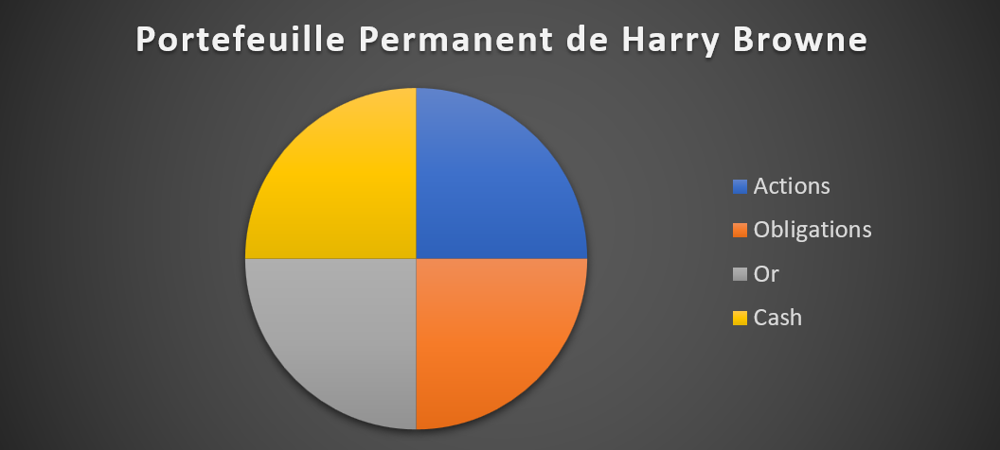
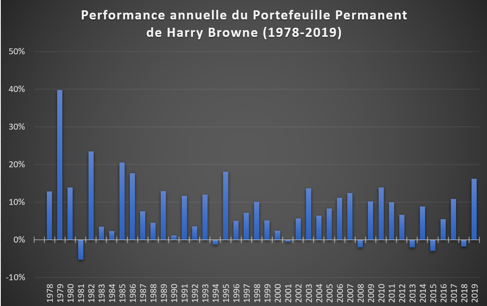
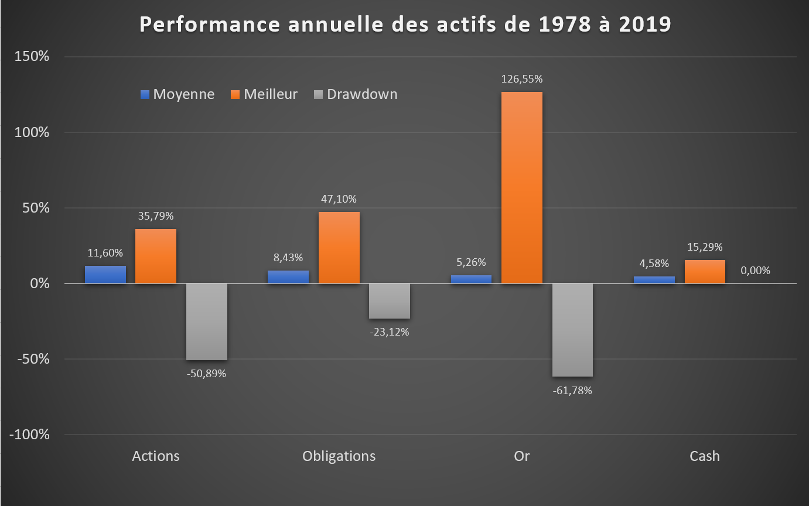
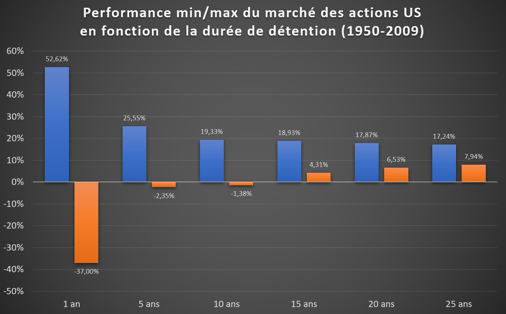
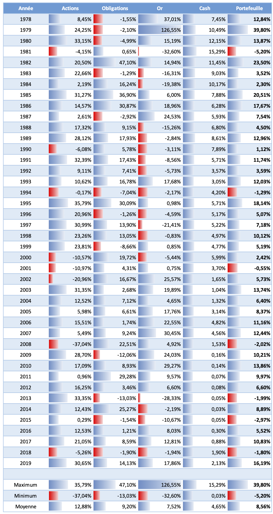
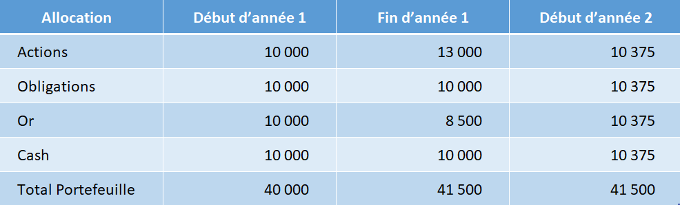
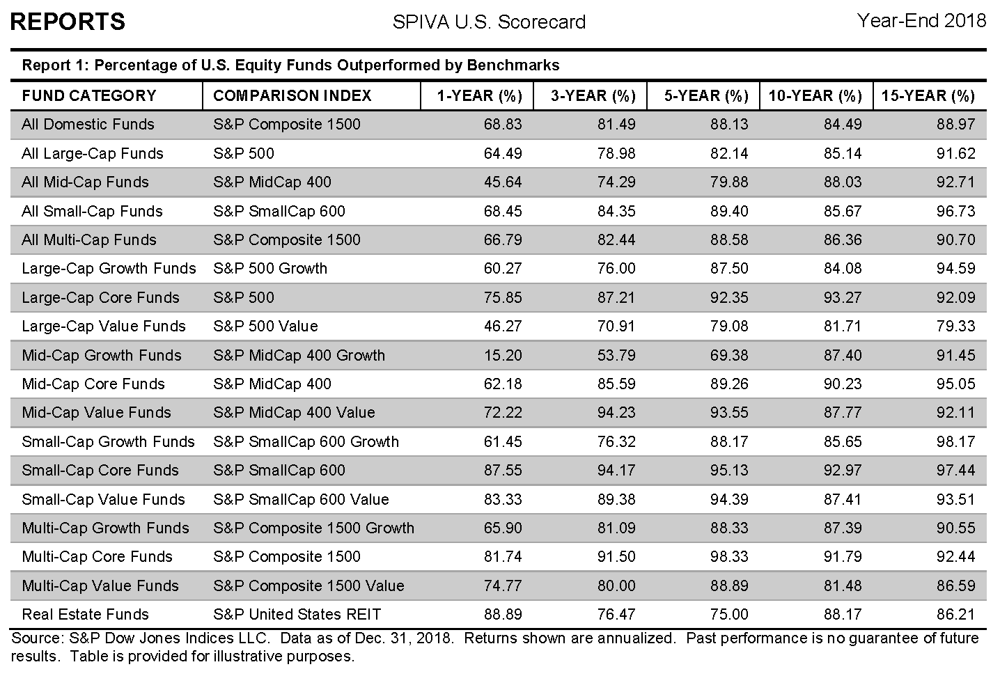

    

### Introduction au Portefeuille Permanent

Maintenant que nous avons défini le concept d'autonomie financière en première partie, l'étape suivante va être comment s'y prendre?

Pour la suite de mon exposé, je vais utiliser une stratégie d'épargne connue de certains investisseurs américains, le Portefeuille Permanent de Harry Browne. J'utiliserai cette stratégie comme support didactique pour vous expliquer les concepts importants à connaître dans la gestion d'un portefeuille financier.

[Harry Browne](https://en.wikipedia.org/wiki/Harry_Browne) (1933-2006), était un écrivain de nationalité américaine, investisseur et fervent défenseur des libertés individuelles. Il publia en 1999 son ouvrage ["Fail-Safe Investing"](https://www.amazon.com/gp/product/031226321X/) , dans lequel il présente la stratégie du « Permanent Portfolio".

Voici la stratégie:

**_Harry Browne préconise un investissement dans les 4 classes d'actifs les plus pures qui existent en finance: les actions, les obligations, l'or et le cash. L'investissement doit être réalisé à parts égales sur ces 4 actifs et les poches doivent être rééquilibrées chaque année._**

Nous utiliserons les indices américains qui offrent l’historique de données le plus important. Mais le raisonnement pourra être extrapolé à tout autre pays.

La stratégie repose sur l’exploitation des cycles économiques qui sont au nombre de 4:
- Prospérité
- Récession
- Inflation
- Déflation

Chacun de ces cycles économiques va apparaître, dans n’importe quel ordre et pour des durées variables.

**L'économie est soit en expansion et nous connaissons la prospérité, soit en contraction et nous sommes alors en période de récession.**

Relativement à cette expansion-contraction de l'économie, la quantité de monnaie en circulation va elle aussi évoluer.

**Si la quantité de monnaie croit plus rapidement que l'expansion de l'économie, nous aurons de l'inflation (trop de monnaie dans le système). A l'inverse si la quantité de monnaie croit plus lentement que l'expansion de l'économie, alors nous aurons de la déflation (manque de monnaie dans le système).**

**Le phénomène est le même dans une économie en récession, si la quantité de monnaie diminue moins rapidement que l'économie ne se contracte, nous aurons de l'inflation, et si la quantité de monnaie diminue plus rapidement que l'économie ne décroit, nous aurons alors la déflation.**

La quantité de monnaie en circulation doit être adaptée au niveau de croissance ou décroissance de l'économie. C'est normalement le rôle des banques centrales d'ajuster ces niveaux de monnaie.

Ce sont des lois quasi absolues dans un système capitaliste libéral. À tout moment, l'économie évoluera dans l'une de ces 4 phases (croissance ou récession avec inflation ou déflation). Le temps passé dans chacune de ces phases peut varier de quelques mois, dans le cas par exemple d'une récession de courte durée, à une dizaine d'années, cas de la dernière période de croissance qui a suivi la crise immobilière de 2008.

Le déroulement et l'ordre des phases est difficile à prévoir. Il est toujours clair à fortiori de savoir dans quelle phase nous étions quand nous en sommes sortis, mais c'est souvent moins évident sur le moment présent. Sommes-nous en ce moment-même en période de croissance ou de contraction de l’économie?  La quantité de monnaie en circulation est-elle adaptée, en excès et source d’inflation, ou insuffisante et source de déflation?

A chacune de ces 4 phases du cycle économique correspond à un actif qui est le plus approprié pour bien performer:
- Prospérité: bon pour les actions
- Récession: bon pour les liquidités
- L'inflation: bon pour l'or
- Déflation: bon pour les obligations

En période de croissance il vaut mieux détenir des actions, en période de récession des liquidités, en période d’inflation de l’or et en période de déflation des obligations.

Ainsi, Harry Brown recommande de détenir chacun de ces 4 actifs en permanence, c'est-à-dire tout au long de l'année et à parts égales:
- La poche action est investie sur l’indice du marché action des USA
- La poche obligation est investie en obligations à long terme de l'État des USA
- L'or est détenu au travers d'un fonds ou partiellement en or physique
- Le cash est investi sur des fonds monétaires sans risques

La beauté de cette allocation est qu'elle n'essaie pas de prédire l'évolution future de l'économie pour savoir sur quel actif investir. Il s'agit simplement de maintenir une allocation équilibrée entre ces 4 actifs. Ainsi nous aurons toujours au moins un actif approprié pour bien performer eu égard à l'état dans lequel l'économie se situe.

Ce type de portefeuille peut être réalisé très simplement et à moindre coût avec des trackers (ETF) ou fonds d'investissements.

Chaque fin d'année, il suffira de rééquilibrer les 4 poches, c'est-à-dire vendre les actifs qui auront le plus progressé pour acheter ceux qui auront baissé ou le moins progressé.

Comment une épargne ainsi investie s’est-elle comportée dans le passé?

Voici la performance historique de la stratégie du Portefeuille Permanent de Harry Browne depuis 1978 pour le marché US:

Une somme unique investie de 10'000€ en 1978, s'est transformée fin 2019 en un capital brut de 281'182€.

Cela représente un rendement brut annualisé moyen de 8,27% avec plus de 80% des années qui ont eu un rendement positif et la plus mauvaise année n'était qu'une faible perte de -5,20%.

En déduisant l'inflation le rendement annuel moyen est de 4,67%, soient 40 ans à progresser à quasiment +5% par an au-dessus de l'inflation, diantre!
 

Comment une stratégie aussi simple peut-elle performer aussi bien? Une stratégie aussi efficace devrait être connue de tous?

Commençons par comprendre pourquoi la stratégie fonctionne, pour cela nous allons aborder les notions de risque, rendement et volatilité. La stratégie du Portefeuille Permanent de Harry Browne est composée de 4 actifs distincts qui peuvent être considérées comme les briques élémentaires de la finance, le marché des actions, les obligations, l'or et le cash. Chacune de ces classes d'actif a des caractéristiques de rendement et de risque qui lui est propre.
  

### Le rendement et le risque

Nous savons, ou du moins nous nous doutons, qu'il ne peut y avoir de rendement sans risque, sauf à croire au Père Noël et confier son argent à un [Bernie Madoff](https://en.wikipedia.org/wiki/Bernie_Madoff) qui promettait des rendements réguliers. 

Voyons ce que sont les couples rendements-risques pour les actions, obligations, l’or et le cash sur le marché américain.

Ce graphique fait apparaître la performance moyenne de ces 4 actifs depuis 40 ans, avec leur meilleure année, leur "drawdown" et leur performance annuelle moyenne.

J'utilise le concept anglo-saxon de "drawdown" pour quantifier la baisse la plus élevée rencontrée dans le passé. Le drawdown mesure la perte maximale potentielle qu'il a fallu endurer entre 2 points hauts successifs du marché. Dans le cas de l'or, bien que la plus mauvaise année se termine à -33%, l'or a en fait enchaîné plusieurs années successives de pertes et en mettant bout à bout ces années successives de pertes, l'or a perdu jusqu'à -61,78% avant de repartir à la hausse et faire un nouveau sommet des années plus tard.

Nous pouvons voir des disparités importantes. L'or est l’actif qui a l'amplitude la plus élevée, sa meilleure année est à +126% et son drawdown s’établit à -62%.

A l'exception du cash, aucun actif n’est à l’abri d’une ou plusieurs années en pertes. Sur le long terme, le cash investi sur des placements monétaires sécurisés du type assurance vie et livrets bancaires, a plus ou moins rapporté le niveau de d’inflation, quand cette inflation n’est pas trop forte.

La contrepartie d'un risque plus élevé est normalement un rendement annuel moyen plus élevé. C'est une caractéristique essentielle des économies capitalistes libérales, où à risque plus élevé doit correspondre une rémunération plus élevée, sinon à quoi bon prendre des risques et entreprendre?

Sur le marché américain, les actions apparaissent comme l'actif le plus rentable avec un rendement annuel moyen de +11,60% sur les 40 dernières années, suivi des obligations à long terme, de l'or et du cash.

Cette amplitude de variation me permet maintenant d'introduire un concept important qui est celui de la volatilité.
  

### La volatilité

Parmi ces 4 actifs, l'or est visiblement l'actif le plus volatile car il est capable de variations extrêmement importantes d'une année sur l'autre. A l’opposé, le cash est l'actif le moins volatile. La volatilité est une grandeur exprimée en pourcentage qui tente de quantifier la propension d'un actif à bouger ou à s'agiter si vous préférez. Il est généralement admis que plus un actif est volatile, plus il est risqué.

Le marché des actions US de 1978 à 2019 a eu une volatilité de 15,11%, les obligations à long terme 11.06%, l'or 18.80% et le cash 4.60%

La volatilité d'un actif est une mesure imparfaite du risque réel, car le temps de détention de cet actif va énormément influencer notre perception du risque.

Voyons l'influence du temps dans notre perception du risque sur le marché des actions en particulier:

Voici comment se lit ce graphique:

- Pour un investissement en actions d'une durée de 1 an, vous auriez pu gagner +52,62% et perdre -37% en une seule année.
  
- Si nous détenons notre portefeuille d'actions au moins 5 ans, le rendement annuel moyen passé évolue désormais entre +25,55% et -2,35%, c'est de tout évidence beaucoup moins risquée.
  
- Aucune des périodes passées d'une durée de 15 ans au moins n'a fini en perte depuis 1950 et le rendement annuel moyen a été au minimum de +4.31%.
  
- Pour toutes les périodes de 20 ans précédentes, le rendement annuel moyen était au minium de 6,53% avec même un maximum à +17,87%.
  

**Je pense que vous commencez à percevoir la volatilité (le risque) différemment!**

Les premiers fonds d’investissements indiciels ont été créés aux États-Unis au milieu des années 1970. Une épargne investie sur l’indice des actions américaines de 1978 à 2019 a délivré une performance annuelle moyenne de 12.88%. Si vous retirez l’inflation pour comparer en monnaie constante, la performance nette est un remarquable 9.41% par an!
  

### La Diversification

Nous pouvons désormais aborder un concept essentiel dans la constitution d'un portefeuille financier, il s'agit de la diversification appelé également décorrélation.

Reprenons notre exemple du Portefeuille Permanent de Harry Browne et voyons la performance annuelle de chacun des actifs qui le composent depuis 1978:

Prêtez attention à la performance des actifs, les uns par rapport aux autres. Vous pouvez remarquer qu’ils ont tendance à bien performer chacun leur tour.

Lorsque l'économie est en récession et que les actions subissent des pertes importantes (crise internet de 2000, 2001, 2002 et crise immobilière de 2008), les obligations à long terme vont généralement bien performer et compenser en partie les pertes de la poche actions. Lorsque les obligations ont souffert, l'or a généralement pris le relais pour bien performer à son tour.

Les périodes où ces 3 actifs perdent de la valeur en même temps sont finalement assez rares. Pour la grande majorité des années, vous avez toujours un ou plusieurs actifs qui vont bien performer et ainsi soutenir la performance globale du portefeuille.

Comparativement, le cash joue un rôle un différent, il est là pour amortir la volatilité globale du portefeuille du fait de sa très faible variation. Il ne va pas ou peu contribuer à la croissance du portefeuille, mais il va aider à le stabiliser.

Harry Browne a sélectionné ces 4 actifs sur la base de leur décorrélation, c'est-à-dire qu'ils vont évoluer indépendamment les uns des autres, puisqu'ils sont adaptés pour bien performer, à tour de rôle, dans chacun des cycles économiques qui va se succéder. Durant les périodes de prospérités le moteur de la performance sera les actions, en période d’inflation l’or, en période de déflation les obligations et en période de récession le cash. C’est ce phénomène de diversification qui fait que la performance globale du portefeuille est incroyablement régulière, même si les actifs qui le composent peuvent être très volatils, considérés isolément.

**Vous avez là, la clef d'un portefeuille bien constitué Il ne s'agit pas de se focaliser sur la recherche d’actifs qui vont bien performer chaque année sur le marché, mais plutôt de détenir des actifs qui vont bien performer à des moments différents les uns des autres, afin de lisser la performance globale du portefeuille. Constituer un portefeuille diversifié est bien plus important que rechercher le meilleur placement sur lequel investir ses économies.**

Constituer un portefeuille diversifié est bien plus important que rechercher le meilleur placement sur lequel investir ses économies.

La diversification au travers de classes d’actifs diversifiés offre également un avantage supplémentaire. Considérez le scénario d'un crash boursier comme en octobre 1987 où le S&P500 a perdu 20.4% en une seule journée. Comme la poche action ne représente que 25% du portefeuille, l’impact total au niveau du portefeuille global ne représente plus que le quart de cette perte, soient 5%, ce qui est quand même beaucoup moins éprouvant!
  

### Le rééquilibrage

Au fils du temps, les montants investis sur chacune des 4 poches qui compose le Portefeuille Permanent vont évoluer. Certains actifs vont prendre de la valeur et d’autres en perdre.  Afin de préserver les bénéfices de la diversification, qui permet de lisser la performance globale du portefeuille, vous devez vous assurer que les 4 poches restent à peu près équilibrées.

Considérons par exemple une année où les actions ont progressé de 30%, l’or a baissé de 15%, les obligations et le cash sont restés inchangés. Vous devez à la fin de l’année rééquilibrer votre portefeuille pour que chaque poche redémarre à 25% de la valeur totale du portefeuille. C’est-à-dire dans notre cas, revendre une partie des gains réalisés sur les actions pour acheter principalement de l’or et un peu de cash et d’obligations.

Le rééquilibrage se fait uniquement quand les poches sont devenues significativement déséquilibrées. Si une des poches du Portefeuille Permanent (action, obligation, or, cash) qui doit normalement représenter 25% de l’allocation globale de mon portefeuille, finit par en représenter 35% (en gain) ou 15% (en perte), je dois alors rééquilibrer les poches entre-elles.
  

### Les supports d'investissements

Comment choisir les meilleurs supports sur lesquels investir, faut-il privilégier les actions individuelles ou confier son épargne à des fonds d’investissements?

La réponse est assez simple, en tant qu’investisseur individuel, vous allez perdre votre temps si vous achetez des actions individuelles, le jeu n’en vaut pas la chandelle.  Il est bien plus aisé d’acheter des fonds ou trackers également appelés ETF, qui sont investis sur le marché des actions que d’acheter des actions individuelles et de devoir faire un suivi régulier de chacune d’entre-elles. Lesquels acheter, combien d’actions différentes acheter? Si j’en achète trop peu, c’est-à-dire moins d’une dizaine et qu’une de ces actions fait faillite je risque de perdre 1/10 de la valeur de mon portefeuille actions. Un fonds bien diversifié sur le marché des actions n’a aucun de ses investissements qui concentre plus de 3 à 4% de la valeur total du fonds. Si vous voulez prendre la même précaution cela veut dire qu’il vous faudra investir dans au moins 25 lignes d’actions différentes. Et je ne parle ici que de l’allocation dans la classe d’actif des actions, le même problème va se répéter avec vos autres investissements dans les autres classes d’actifs tels que les obligations, le cash, etc.

Il existe principalement 2 catégories de fonds sur les marchés, les fonds à gestion active et les fonds à gestion passive.

- Un fonds est dit à gestion active quand le gérant décide lui-même sur quels actions, obligations investir, dans le but de faire mieux que l’indice du marché sur lequel il investit
  

- Un fonds est à gestion passive quand le gérant a pour unique objectif de recopier un indice. Si vous achetez un tracker CAC40, cela signifie que le gérant de ce fond doit recopier le plus exactement possible l’indice CAC40, il doit donc avoir en portefeuille la composition exacte des actions qui composent l’indice CAC40. On ne demande pas à ce gérant de prendre des initiatives dans la gestion du tracker, mais simplement d’être aussi rigoureux que possible pour recopier la performance de l’indice CAC40 au plus juste et à moindre coût.
  

Les frais de gestion prélevés par les gérants de fonds passifs sont bien plus faibles que les frais de gestion prélevés par les gérants de fonds actifs, car ils ont beaucoup moins de travail. Alors qu’un fond actif peut facilement prélever plus de 1% en frais de gestion, les fonds passifs se situent plutôt autour de 0.10% soient 10 fois moins.  Après 25-30 ans, une différence de 1% dans les frais de gestion peut facilement retirer 15-20% de votre performance totale à l’arrivée.

Quelle gestion pensez-vous sera la plus performante à long terme?

**De très loin la gestion passive! Quasiment aucun manager n’arrive à délivrer une performance sur le long terme qui permet de compenser le surcoût occasionné par leurs frais de gestion.**

Chaque année, l’étude [SPIVA](https://us.spindices.com/spiva/) compare la performance des fonds actifs et passifs qui sont investis sur les même marchés. A partir d’une durée de 5 ans, 80% des managers des fonds actifs font moins bien que leur indice de référence. Au-dessus de 15 ans, c’est 90% des gestionnaires qui sont battus par l’indice. Conclusion, mieux vaut investir dans l’indice directement, c’est-à-dire choisir des trackers sur indice à gestion passive.

Dernière colonne de droite, pourcentage des gérants de fonds qui échouent à battre leur indice de référence, la statistique est sans appel!

Souvenez-vous quand j’ai introduit le Permanent Portfolio, j’ai formulé la question suivante: « Une stratégie aussi efficace devrait être connue de tous? »

La raison pour laquelle ce type de stratégie n’est pas plus répandue est très simple à comprendre, elle demande que vous soyez investi dans des fonds passifs, qui prélèvent le moins de frais possible et votre travail se limite à une opération de rééquilibrage chaque année. Il est impossible pour un gérant, dans de telles conditions, de prélever 1 à 2% de frais de gestion chaque année, quand il n’y a pas en plus des frais d’entrée et de sortie encore plus élevés! C’est toute une industrie qui dépend de votre croyance en leur savoir-faire, pour justifier des frais scandaleusement élevés.

Investir au travers de trackers passifs qui recopient des indices ne veut pas dire pour autant que vos choix d’investissements vont être limités. Bien au contraire, il existe des indices sur à peu près toutes les classes d’actifs, que ce soient les marchés des actions, l’immobilier, les obligations d’États, les obligations d’entreprises, les métaux précieux, les matières premières agricoles, pétrolières. Il existe plusieurs centaines de familles de trackers différentes sur lesquels investir.

**Alors que l’investisseur débutant a souvent tendance à se focaliser sur quelle action ou obligation acheter, en fait aussi surprenant que cela puisse paraître, cela importe assez peu. Si votre portefeuille d’actions ou d’obligations est suffisamment diversifié, la performance de ces allocations finira par s’aligner sur la performance globale du marché sur lequel vous êtes investi. Il est bien plus payant de d’ajouter des classes d’actifs supplémentaires et diversifiées, comme l’immobilier, les matières premières, plutôt que chercher à optimiser la liste des actions que l’on détient dans son allocation actions.**

Aujourd’hui les investisseurs privilégient largement les trackers sur indices à gestion passive avec les frais les plus faibles. Le tracker le plus important est le SPY du gestionnaire américain State Street Global Advisors qui recopie la performance du S&P500. Le montant des capitaux en gestion sur ce seul tracker étaient de plus de 300 milliards de USD début 2020 et les frais de gestion de 0.09% par an.
  

### Résumé

Vous voici à la fin de mon exposé. Si vous étiez totalement débutant en matière d’investissements financiers, j’espère que j’aurai répondu en partie aux questions que vous vous posiez et rendu plus accessible une discipline qui peut sembler de prime abord compliquée ou réservée aux professionnels. Il n’en est rien, avec un peu de bon sens et de culture financière, chacun d’entre nous est parfaitement capable de gérer un portefeuille d’actifs financiers dans la durée et avec succès.

Vous avez désormais suffisamment de connaissance pour poursuivre l’apprentissage de cette discipline, par vous-même. J’aurai l’occasion d’aborder plus en détail dans ce blog, les différents sujets que j’ai introduit dans ce bref exposé.

Reprenons tout ce que nous avons vu :

- Une épargne correctement investie permet de générer un revenu financier inépuisable, tant que vous ne prélevez pas plus que cette épargne ne rapporte à long terme.
  
- Un taux de prélèvement annuel de 4% peut être considéré comme prudent.
  
- Si ce revenu financier couvre vos dépenses, vous êtes alors financièrement autonome.
  
- Dans cet effort d'épargne, les intérêts composés seront votre meilleur allié. Plus tôt vous épargnez, plus facile se fera la constitution de cette épargne.
  
- Les principales classes d'actifs en finance sont les actions, les obligations, l'or et le cash. Ces actifs présentent des caractéristiques de rendement et de volatilité très différents.
  
- Plus la volatilité est élevée, plus le risque peut être considéré comme élevé, mais plus la période de détention s'allonge, plus le risque de subir une perte se réduit.
  
- Le marché des actions est la classe d’actif qui offre le meilleur rapport rendement risque sur le long terme.
  
- La diversification des investissements au travers de plusieurs classes d’actifs décorrélés, comme le sont les actions, les obligations, l’or et le cash, permet de lisser la performance globale d’un portefeuille.
  
- Un portefeuille doit être maintenu équilibré afin de préserver les effets bénéfiques de la diversification.
  
- Les supports d’investissements à privilégier sont les trackers d’indices à gestion passive.
  
Quel chemin parcouru en seulement une petite heure de lecture !
  
