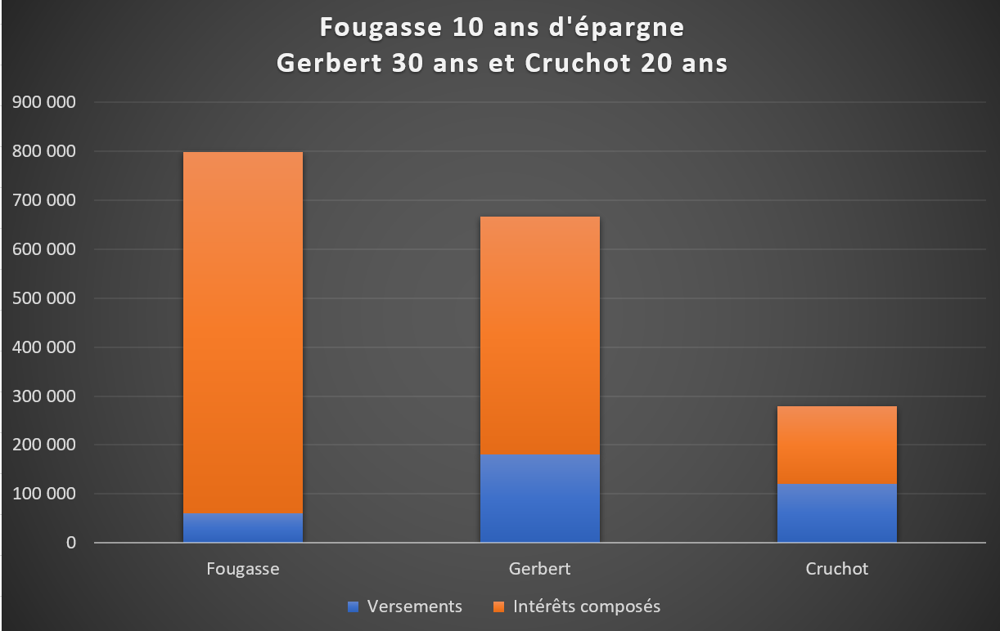

    

### Introduction
L'inculture économique en France est telle que la plupart des gens n'ont absolument pas conscience de l’importance à se constituer un patrimoine financier et des avantages qui vont en découler.

La grande majorité de la population a pour unique source de revenu un salaire mensuel et n'envisage l'amélioration de son niveau de vie qu'au travers de l'augmentation exclusive de cette rémunération. Nous allons structurer notre vie privée et professionnelle en fonction des opportunités d’augmentation de ce salaire. Les autres sources de revenus possibles seront généralement négligées, soit par méconnaissance soit parce que notre relation à l'argent est biaisée.

La vie va alors se dérouler au rythme métro-boulot-dodo, les courses le week-end, quelques semaines de vacances épuisantes l'été dans des endroits bondés de monde et l'espoir de pouvoir profiter un peu de la vie une fois en retraite. L'essentiel du patrimoine accumulé au cours d'une vie sera le plus souvent un peu d'immobilier qui ne rapporte rien et des liquidités dormantes sur des livrets bancaires ou assurances-vie.

Il est pourtant possible de sortir de ce schéma classique, plus ou moins imposé par les conventions sociales et de jouir d'une grande liberté financière.

Comme nous allons le voir, une épargne investie sur les marchés financiers peut nous permettre d’atteindre cet objectif.
  

### Mention
Je vais focaliser mon exposé sur les concepts que j’ai jugé les plus importants à comprendre. Je laisserai volontairement de côtés d'autres éléments, importants également, comme la fiscalité, mais qui ne vont rien apporter à la compréhension des principes globaux qu'il est impératif de maîtriser.  Dans la mesure du possible je raisonnerai en monnaie constante, c’est-à-dire que j’élimine les effets de l’inflation. Je vais utiliser comme support les marchés US qui ont l'avantage d'offrir les données historiques les plus longues, mais le même raisonnement peut s’appliquer à l’Europe ou à la France en particulier.
  

### L'autonomie financière

Puisque ce blog est basé sur l'autonomie financière, il est important de comprendre ce que cela signifie.

**Si vous vous êtes constitué une épargne et ne dépensez pas plus que ce que vos investissements vous rapportent, vous pourrez alors vivre indéfiniment de ces investissements, sans limite de temps.**

Concrètement, si sur une année votre épargne investie progresse de 6% et que l'inflation est de 1%, vous pourrez consommer 5% de cette épargne et maintenir indéfiniment votre pouvoir d'achat. Eu égard à la performance historique des marchés boursiers et des niveaux d'inflations passés, il est communément admis que si vous ne retirez pas plus de 4% de votre épargne chaque année, il est hautement improbable que vous finissiez à cours d'argent. Dis autrement, il est possible de vivre indéfiniment de son épargne investie si l'on ne consomme pas plus de 4% de cette épargne chaque année.

Ce niveau de 4% a été initialement défini par William P. Bengen[1] lors d'une étude publiée en 1994 dans laquelle il a calculé et défini la notion de SWR (Safe Withdrawal Rate) ou Taux de Retrait Sécurisé en français. Ce SWR a été établi sur base de la performance historique du marché des actions aux USA depuis 1926 et des niveaux d’inflation. Il a calculé qu'une épargne investie majoritairement sur les marchés actions avait pu traverser tous les chocs financiers passés si l'on ne prélevait pas plus de 4% de cette épargne chaque année. Le concept de SWR a été par la suite repris et approfondi dans de nombreuses recherches, dont la plus connue, la Trinity Study[2] de 1998.

L'objectif est donc d'accumuler une épargne, jusqu'à ce que les revenus passifs générés par cette épargne, suffisent à couvrir les dépenses annuelles. Lorsque cette autonomie financière est atteinte, vous voilà libre de vivre et travailler comme vous l’entendez.

Si vous avez besoin pour vivre, de 30'000€ par an, alors ce montant pourra être généré indéfiniment à partir d'une épargne de 750'000 euros (4% de 750k = 30k). En réalité ce niveau de 4% est très prudent, j’estime qu’il est tout à fait possible de retirer jusqu'à 6% par an avec des stratégies de gestion bien adaptées. Auquel cas, l'épargne nécessaire pour être financièrement autonome si vous souhaitez vivre avec 30'000€ par an est plus aux environs de 500'000€.

Bien peu de personnes ont pleinement conscience que toute somme d'argent correctement investie peut être convertie en un revenu permanent. Vous pouvez faire l’analogie avec les rentes viagères, mais dans notre cas, nous restons propriétaire de notre capital.

Bien sûr, pour la plupart des gens, y compris moi-même, cela nécessitera d'épargner une part substantielle de ses revenus et de les investir pour les faire fructifier, suffisamment longtemps.

Si vous débutez votre effort d'épargne assez tôt, vous allez alors bénéficier de ce que l'on appelle les intérêts composés. Et ce qui peut paraître à première vue comme un objectif d'épargne difficile à atteindre, va pouvoir se réaliser avec assez peu d’effort.
  

### Les intérêts composés

Les intérêts composés sont un concept extrêmement puissant qui est la base de quasiment toutes les stratégies d'épargne financière que vous allez rencontrer.

Albert Einstein lui-même, aurait qualifié avec humour, les intérêts composés de force la plus puissante de l'univers:

**_"Les intérêts composés sont la huitième merveille du monde. Celui qui les comprend les accumule, celui qui ne les comprend pas les paie"._**

Le terme intérêts composés[3] signifie simplement que vous allez gagner des intérêts sur les intérêts précédemment accumulés.

Considérons un capital fixe de départ de 10'000 rémunéré à 10% chaque année :

- Année 1 : 10'000 x 10% = 1'000€ d'intérêts
- Année 2 : (10'000 + 1000) x 10% = 1'100 d'intérêts
- Année 3 = (10'000 + 1'000 + 1'000) x 10% = 1'200 d'intérêts
- Etc.

Vous pouvez constater que les intérêts reçus ne restent pas fixes à 1’000€ mais augmentent un peu plus chaque année, car le capital sur lequel ils s'appliquent a lui-même été augmenté des intérêts précédemment accumulés.

Bien que cela puisse paraître anodin, c'est pourtant un concept essentiel, car la puissance des intérêts composés est phénoménale. Et ce qui pouvait à première vue paraître comme un objectif d'épargne difficile à atteindre, comme devenir financièrement autonome, va pouvoir se réaliser sans trop d'effort, pour qui veut bien se donner un peu de temps.

J’utilise le mot intérêt au sens large, pour définir tous les flux financiers qui participent à faire grossir votre épargne : les intérêts d‘un livret bancaire, le coupon d’une obligation, la plus-value lors de la revente d’une action, le versement d’un dividende, etc.

Pour bien saisir l'importance de la composition des intérêts, considérons deux exemples pratiques.
  

**Exemple 1 - Combien épargner pour accumuler 500'000 puis 1 million d'euros?**

Considérons que vous épargniez 500€ par mois, soient 6’000€ par an.

L'épargne est investie sur les marchés financiers avec un rendement annualisé moyen de 7,5% par an, nous ne considérons pas la fiscalité et l'inflation, nous raisonnons donc en euros constants pour simplifier.

Au bout de cinq ans, les intérêts accumulés s'élèvent à 7'464€.

Au bout de dix ans, c'est-à-dire qu'une même période de 5 ans supplémentaire s'est écoulée, les intérêts s’élèvent désormais à 31’249€, soient un supplément de 23’785€. Comparativement à la période initiale de 5 ans c’est 3 fois plus d’intérêts accumulés pour la même durée de détention.

Vous voyez clairement que la formation du capital s’accélère avec le temps. Vous avez là le phénomène de ce que l’on appelle les « intérêts composés », qui finissent d'ailleurs après un certain temps, par être la contribution prépondérante à la formation de votre épargne.

Le niveau des 500’000€ sera franchi au cours de la 27ième d’année d’épargne. Pour quelqu’un qui aurait commencé à épargner vers 25 ans, cela veut dire ½ millions d’euros épargnés à 50 ans, soit l'équivalent de 20k-30k€ en revenus financiers annuels.

Il a fallu 27 ans pour atteindre les 500'000€ et le capital est déjà doublé à 1 million d'euros en 8 ans supplémentaires seulement.

Il suffit d'initier le mouvement, puis laisser s'accumuler les intérêts suffisamment longtemps. La contribution des intérêts à l'accumulation de votre épargne est tellement importante qu'une une fois le cycle vertueux initié pour pourriez même considérer supprimer votre contribution annuelle et laisser votre épargne fructifier d'elle-même.

Simulons ce cas de figure dans notre second exemple.
  

**Exemple 2 - Je n'épargne pas longtemps, mais je démarre tôt**

Considérons maintenant 3 personnes qui investissent chacune 6'000€ par an sur des durées différentes:
- Fougasse investit 500€ par mois de 25 ans à 35 ans, soient 10 ans d'épargne.  
- Gerbert investit 500€ par mois de 35 ans à 65 ans, soient 30 ans d'épargne.
- Cruchot investit 500€ par mois de 45 ans à 65 ans, soient 20 ans d'épargne.

Pareillement au cas précédent, l'épargne est investie sur les marchés financiers avec un rendement annualisé moyen de 7,5% par an.

A 65 ans, nos trois acolytes décident de prendre leur retraite, voici l'épargne qu'ils auront accumulée:

La différence est impressionnante, bien que Fougasse n'ai épargné que pendant 10 ans, soient 60'000€, de l’âge de 25 ans à 35 ans, il aura accumulé le capital le plus important car les intérêts composés auront fonctionné plus longtemps, en l’occurrence pendant 40 ans (25-65 ans).

En comparaison, Gerbert qui aura fourni un effort d'épargne trois fois plus important de 180'000€ puisque qu'il aura épargné pendant 30 ans, de 35 ans à 65 ans, ne pourra jamais rattraper Fougasse parti le premier.

En ce qui concerne Cruchot, une épargne de 120'000€ constitué tardivement, de 45 ans à 65 ans, soient quand même 20 ans d'épargne, ne lui permettrons d'accumuler que le tiers de l'épargne accumulée par Fougasse, qui aura pourtant épargné moitié moins longtemps que lui.

Retenez qu’après un certain nombre d'année, l'essentiel de l'épargne accumulée ne proviendra pas tant des sommes épargnées mais bien plus de la composition des intérêts. Plus vous commencez tôt, plus vous bénéficierez de l'effet de ces intérêts composés.
  

### Les classes d’actifs

Pour faire fructifier votre épargne et bénéficier de l’effet des intérêts composés, vous allez devoir investir votre épargne. Les investissements vont se faire dans ce que l'on appelle des classes d’actifs. Vous connaissez déjà très certainement les principales classes d’actifs qui existent:

**Les actions**  
Vous êtes propriétaire d'une portion de l'entreprise, pour le meilleur et pour le pire. Si l'entreprise croit, la valeur de votre action va croître, si l'entreprise fait de mauvaises affaires, la valeur de l'action va baisser. En parallèle à la variation de la valeur de l'action, l'actionnaire d'une entreprise peut aussi recevoir un dividende. C'est de l'argent qui provient des profits, que peuvent décider de verser les gérants de l'entreprise à leurs actionnaires (propriétaires). Un environnement économique en croissance est généralement favorable au marché des actions.

**Les obligations**  
Vous prêtez de l'argent à un État ou une entreprise, votre taux de rémunération est connu à l'avance, par exemple 3%, le seul risque est que l'emprunteur fasse faillite et ne puisse plus vous rembourser. Ce risque est normalement moindre pour un État comparativement à une entreprise privée, sauf si vous vous appelez Grèce ! A un risque plus élevé, correspond un taux de rémunération plus élevé. Les obligations sont privilégiées par les investisseurs quand l'économie ne se porte pas bien. Ces derniers préfèrent alors sortir du marché des actions jugé plus incertain et s'assurer un rendement moindre mais garantie, le temps que l’orage passe.

**Les liquidités**  
Normalement ces placements ne présentent pas ou très peu de risque. Nous trouvons les comptes courants, comptes d'épargne, livret A, PEL, assurances-vie en euro, fonds monétaires, etc.

**Les matières premières**  
La valeur des matières premières et très liées aux cycles de l'activité économique. Si l'activité économique est soutenue, les prix auront tendance à progresser, à l’inverse si l’activité est faible, la demande en matière première sera moindre et leur prix baissera.

**Les métaux précieux**  
L'or est le roi des métaux précieux, il présente peu de valeur d'un point de vue industriel, mais reste une valeur refuge quand les temps sont incertains, en particulier en période inflation. Car autant les États peuvent imprimer de la monnaie, qui va perdre de sa valeur, autant ils ne savent toujours pas fabriquer de l'or. Bien souvent, quand l'or s'apprécie, ce n'est pas tant l'or qui monte, mais plutôt les monnaies papiers qui se déprécient, d'où cette impression de voir l'or monter.

**L'immobilier**  
Placement préféré des français, j'y reviendrai plus tard dans des articles spécifiques.

**Divers**  
Oeuvres d'art, collections, troupeau de vaches, forêts, etc.
  
Petit exemple pour bien comprendre la différence entre une action est une obligation:

Si vous décidez d’ouvrir un restaurant ou d’investir dans le restaurant qu’un ami va ouvrir, votre investissement entre dans la catégorie des achats d’actions. Vous serez propriétaire d’une partie du restaurant et ne toucherez une rémunération que si le restaurant est rentable, sous la forme d'un dividende. D’un point de vue patrimonial, c’est le même type d’investissement, ouvrir un restaurant que d’acheter des actions McDonald’s. Dans les deux cas, vous investissez votre argent dans le capital d’une entreprise privée. Pour l’un, l’investissement se fera devant un notaire, pour l’autre depuis chez vous, en passant un ordre d’achat sur un marché financier, en l’occurrence celui de la bourse de New York pour McDonald’s.

Si vous prêtez de l’argent pour votre ami ouvrir son restaurant, votre investissement entre dans la catégorie des obligations. Vous allez recevoir des intérêts sur la somme d’argent que vous lui avez prêté, que le restaurant soit rentable ou pas. C’est exactement la même chose si vous souscrivez une obligation McDonald’s, vous prêtez de l’argent pour une durée prédéterminé à l’avance et en contrepartie vous touchez des intérêts, le plus souvent payés trimestriellement, que l’on appelle des coupons.

Aujourd'hui, il n’a jamais été aussi facile de pouvoir investir sur quasiment n’importe quelle classe d’actif, en quelques clics de souris. Vous pouvez décider d’investir sur le marché des actions de tous les pays de la planète, prêtez de l’argent au gouvernement Suédois, à une entreprise chinoise, à des constructeurs d’éoliennes, aux fabricants d’armes américains, acheter de l’or, investir dans une équipe de football, dans une entreprise locale, bref les possibilités sont devenues quasi infinies.
  

**Maintenant que nous avons défini le concept de l’autonomie financière, nous aborderons la mise en pratique dans un second post.**

