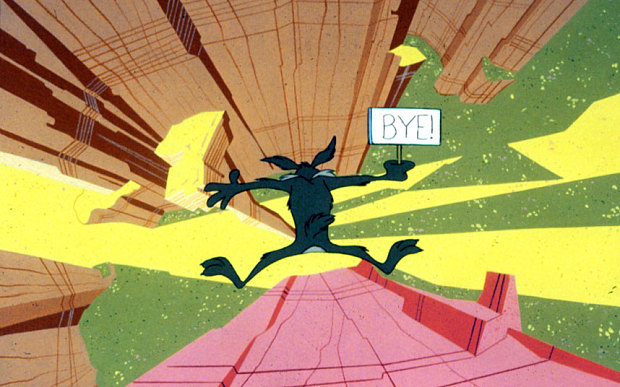
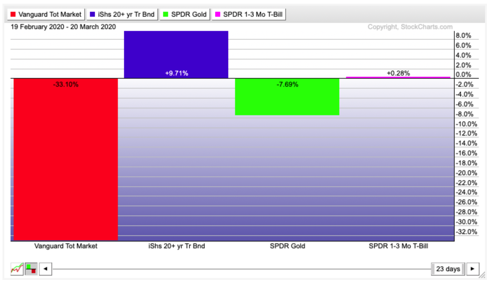
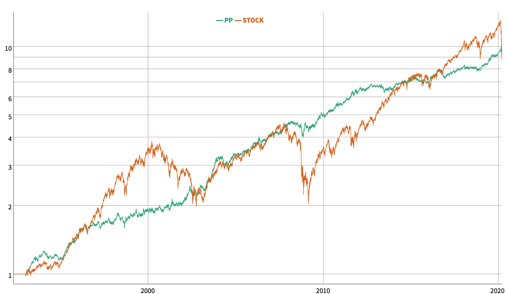
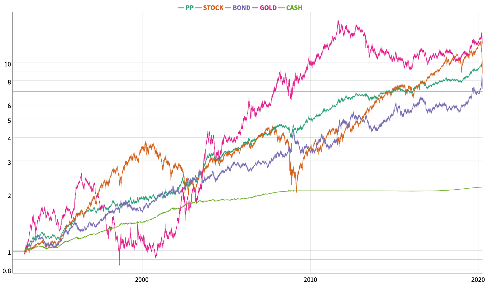
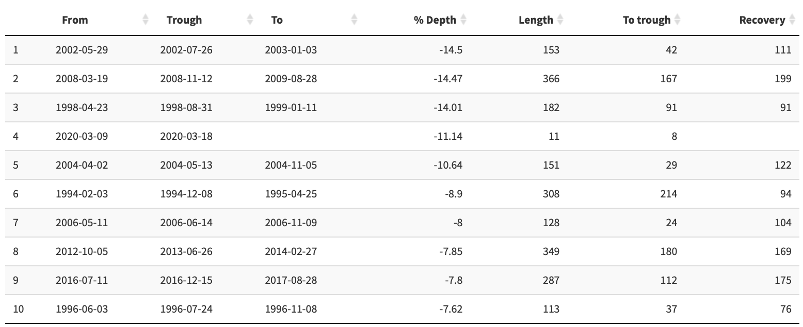
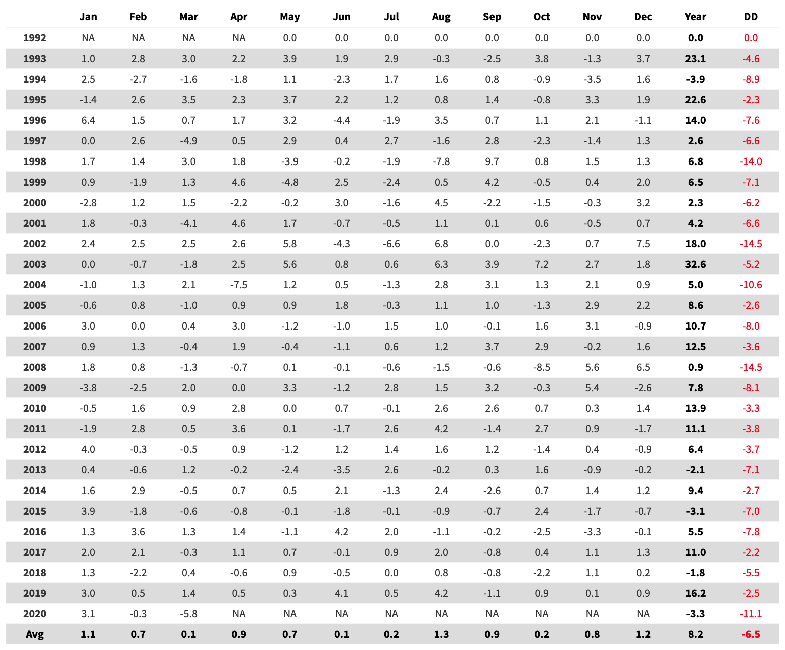
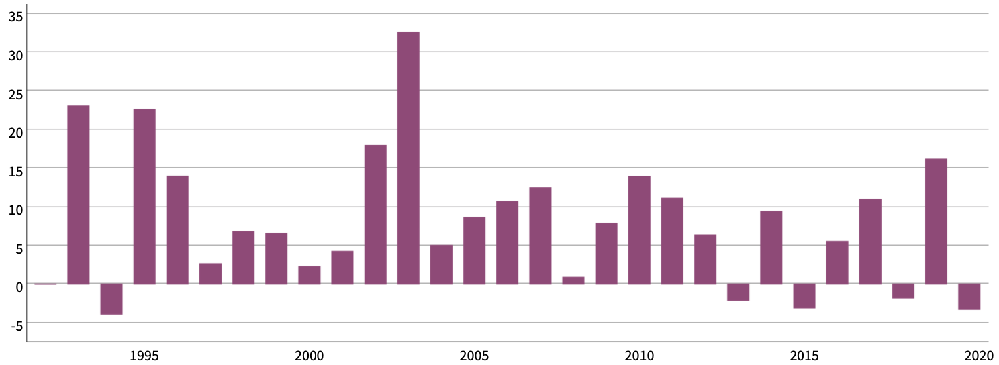

Et voilà, nous y sommes, après 11 ans de hausse, le coronavirus est venu siffler la fin de la partie.

Le S&P500 est passé de 666 en 02/2009 à 3380 en 02/2020, soient une hausse annualisée moyenne de 15,90% par an. C'était de tout évidence non tenable et le moins que l'on puisse dire, c'est que le retournement a été très violent, un véritable feu d'artifice!

Voyons comment s'est comporté le Portefeuille Permanent de Harry Browne au cours des dernières semaines :

On voit très bien l'effet de la diversification jouer entre les différentes classes d'actifs. Quand les actions subissent un choc important, les obligations ou l'or vont jouer le rôle de valeur refuge et compenser en partie les pertes. Il est impossible de prévoir à l'avance quel sera la valeur refuge, d'où la nécéssité de détenir ces 2 actifs en permanence.

Depuis le dernier point haut du marché action, il y a un mois, le 19/02/2020, l'évolution a été la suivante :

Le PP ayant bien performé en janvier 2020, la perte depuis le début de l'année est limitée à un insignifiant -3,3% en comparaison le S&P500 est à -30%!  

##### Evolution du PP-Browne depuis les 30 dernières années  

*Comparaison avec le marché des actions (VTI) :*

*Comparaison des drawdowns :*

*Une mer d'actifs très volatiles considérés individuellement :*

*Drawdowns passés depuis 1993 :*

*Table mensuelle au 20/03/2020 :*

*Performance annuelle :*

Le Portefeuille Permanent de Harry Browne a une fois de plus parfaitement joué son role. L'objectif du portefeuille est de préserver la valeur d'une épargne en offrant une rémunération supérieur à l'inflaton et de pouvoir supporter les chocs économiques à venir. Pour rappel, l'allocation est constituée uniquement des actifs les plus purs et les plus décorrélé qui soient. Ces actifs ayant des volatilités comparables, l'allocation peut alors être répartie à égalité. Le résultat est un portefeuille non optimisé, donc extrémement solide, pouvant résister à la plupart des chocs financiers. Pour reprendre l'expression de Nassim Taleb, ce portefeuille est anti-fragile.

Le Portefeuille Permanent de Harry Browne peut être [simulé ici](https://nicolaslequeux.shinyapps.io/nlx-pp-input/).  