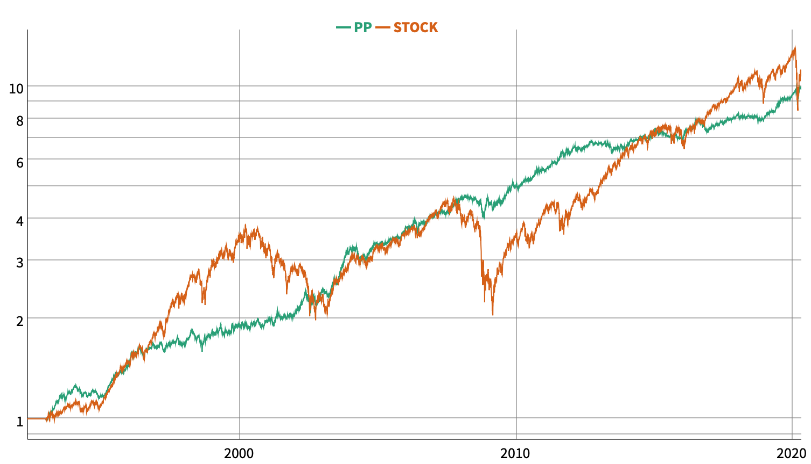
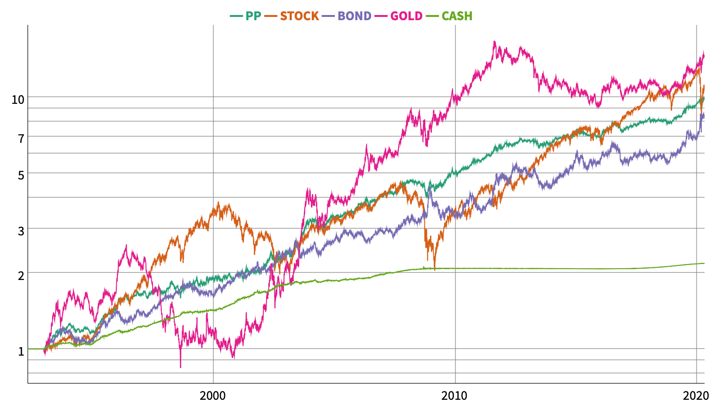
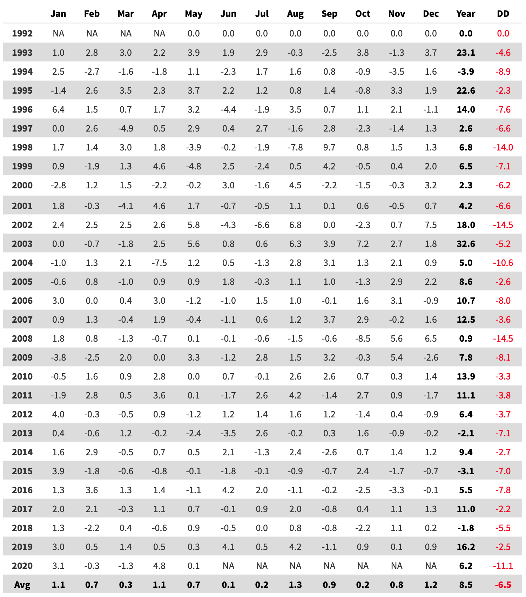

Et voilà, nous y sommes, après 11 ans de hausse, le coronavirus est venu siffler la fin de la partie. Le S&P500 est passé de 666 en 02/2009 à 3380 en 02/2020, soient une hausse annualisée moyenne de 15,90% par an. C'était de tout évidence non tenable et le moins que l'on puisse dire, c'est que le retournement a été très violent, un véritable feu d'artifice!

C'est l'occasion de remettre en perspective la performance du Portefeuille Permanent de Harry Browne.
  

Evolution du Portefeuille Permanent (PP) et du S&P500 depuis 1993

Il est amusant de voir que ces 2 actifs ont délivré une performance comparable au bout de 30 ans. Qui croyez-vous aura le mieux dormi la nuit, l'investisseur cantonné aux marchés des actions ou bien l'investisseur qui a eu un portefeuille bien diversifié?

Pour rappel, le PP est composé des actifs les plus purs qui existent (actions, obligations à long terme, or). Ces actifs sont aussi les plus volatils! Néanmoins, étant bien décorrélés entre-eux, les variations des uns sont compensées par les variations des autres. Au final l'allocation du PP apparait comme un havre de paix "relative" dans une mer d'actifs agités.
  

Evolution des classes d'actifs depuis 1993

  

Comparaison des drawdowns

Depuis 1993, le drawdown du PP s'établit à -14,5% (08/1998) et celui du S&P500 à -55,45% pour une performance comparable!
  

Statistiques 1993-2020

  

Performance mensuelle du PP

  

Historique des principaux drawdowns depuis 1993

La dernière baisse violente du marché des actions a occasionné un drawdown de -11,14% dont le PP est déjà sorti. Il n'aura duré que 33 jours. A la date de rédaction de ce post (08/05/2020), le PP est en hausse de +6,2% depuis le début de l'année!
  

Performances annuelles depuis 1993

  

Zoom sur les 10 dernières années (2010-2020)

  

Simulation mensuelle de long terme (1950-2020)

Enfin, pour terminer, vous avez ci-après une simulation que j'ai réalisé sur le PP avec des données de marchés mensuelles. Le drawdown mensuel (MaxDD) minimise le drawdown réel car les données journalières ne sont pas prises en compte.

Malgrès son caractère approximatif, cette simulation de long terme permet de valider la résilience de l'allocation PP dans les différents environements économiques qui ce sont succédés depuis 1950 (croissance, récession, inflation, déflation).

Sur la période 1950-2020, [l'inflation moyenne aux USA](https://www.usinflationcalculator.com) a été de 3,4%. Le PP a donc été capable de délivrer une performance annuelle moyenne de 7,4% - 3,4% = 4% net au dessus de l'inflation.

N'oubliez pas que le PP a pour objectif de préserver une épargne accumulée et de la faire fructifier de manière raisonnable et donc ne recherche pas la performance absolue. De tout évidence l'objectif a été atteint.

