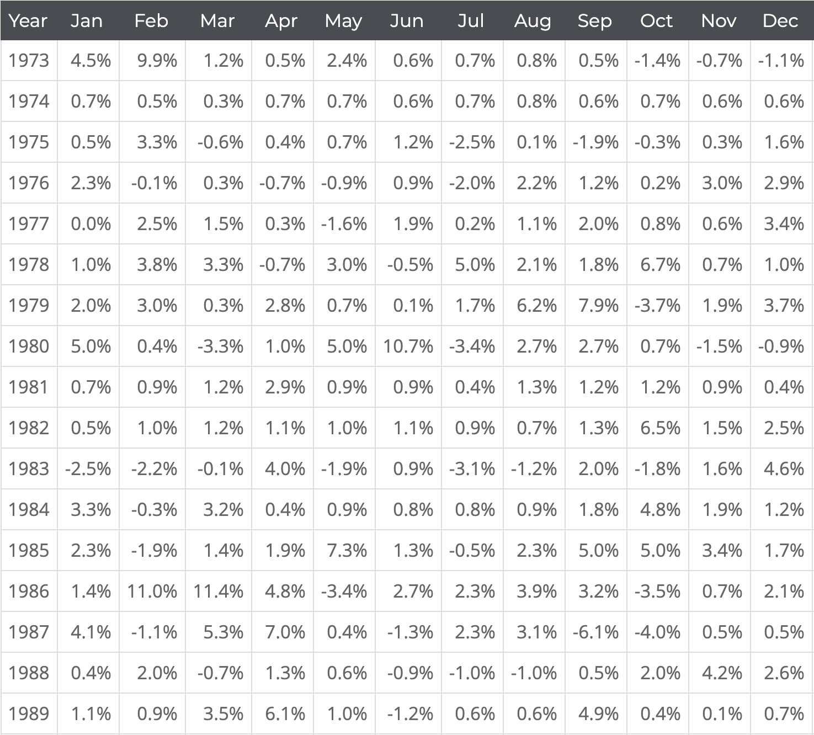

Il arrive fréquement dans mes simulations que j'ai besoin de convertir des données présentées sous forme de table en une seule colonne plus facilement manipulable.

A cet effet j'ai programmé un convertisseur en Javascript qui permet d'automatiser la transformation à partir d'un fichier de type xls, ods, csv.

La table de départ est la suivante :

Il suffit alors de copier-coller les données présentées en colonne dans votre navigateur vers votre tableur Excel, LibreOffice.

Et le tour est le joué!
