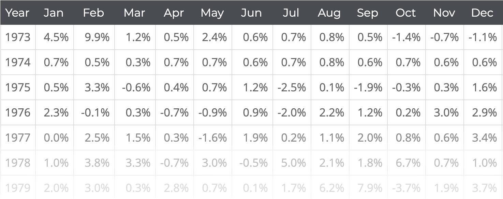

Il arrive fréquement lors de mes simulations que je doive convertir des données présentées sous forme de table en une seule colonne, plus facilement manipulable.

A cet effet j'ai programmé un convertisseur en Javascript qui permet d'automatiser la transformation à partir de fichiers de types xls, ods, csv...
<br></br>

<div class="text-center">
  <a href="https://nicofinance.blog/table-to-column/" class="btn btn-info" role="button" target="_blank" rel="noopener noreferrer">Convertisseur</a>
</div>
<br></br>

<p class="text-center font-weight-bold">La table de départ doit avoir la structure suivante</p>


<br></br>


<p class="text-center font-weight-bold">Code source - Nicolas Lequeux ©</p>


<div style="
  background-color: aliceblue;
  padding: 15px;
  border: 1px solid silver;
  border-radius: 5px;
">

  ```html
  <!DOCTYPE html>
  <html lang="en">
  <head>
    <meta charset="UTF-8">
    <title>From Table to Column</title>
    <script type="text/javascript" src="https://cdnjs.cloudflare.com/ajax/libs/xlsx/0.15.3/xlsx.full.min.js"></script>
  </head>
  <body style="text-align: center;">
    <h3>Fichiers acceptés : xls, csv, ods...</h3>
    <input type="file" id="fileUpLoad">
    <br></br>
    <div id="jsonData"></div>
  </body>
  <script>
    document
      .getElementById("fileUpLoad")
      .addEventListener("change", event => {
        let selectedFile;
        let rowObject;
        selectedFile = event.target.files[0];
        let fileReader = new FileReader();
        fileReader.onload = (event) => {
          let data = event.target.result;
          let workbook = XLSX.read(data, { type: "binary" });
          workbook.SheetNames.forEach(sheet => {
            rowObject = XLSX.utils.sheet_to_row_object_array(workbook.Sheets[sheet]);
            rowObject.forEach(year => {
              // get the value for each key
              Object.values(year).forEach(data => {
                // remove index[0] which holds the year
                if (data !== Object.values(year)[0]) {
                  document.getElementById("jsonData").insertAdjacentHTML("beforebegin",
                    '<p style="margin:0;padding:0;">' + data + '</p>');
                }
              });
            });
          });
        };
        fileReader.readAsBinaryString(selectedFile);
      });
  </script>
  </html>
  ```


</div>
