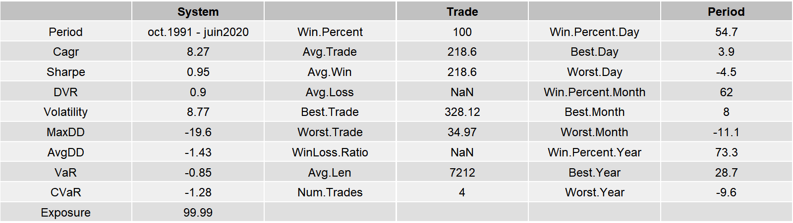
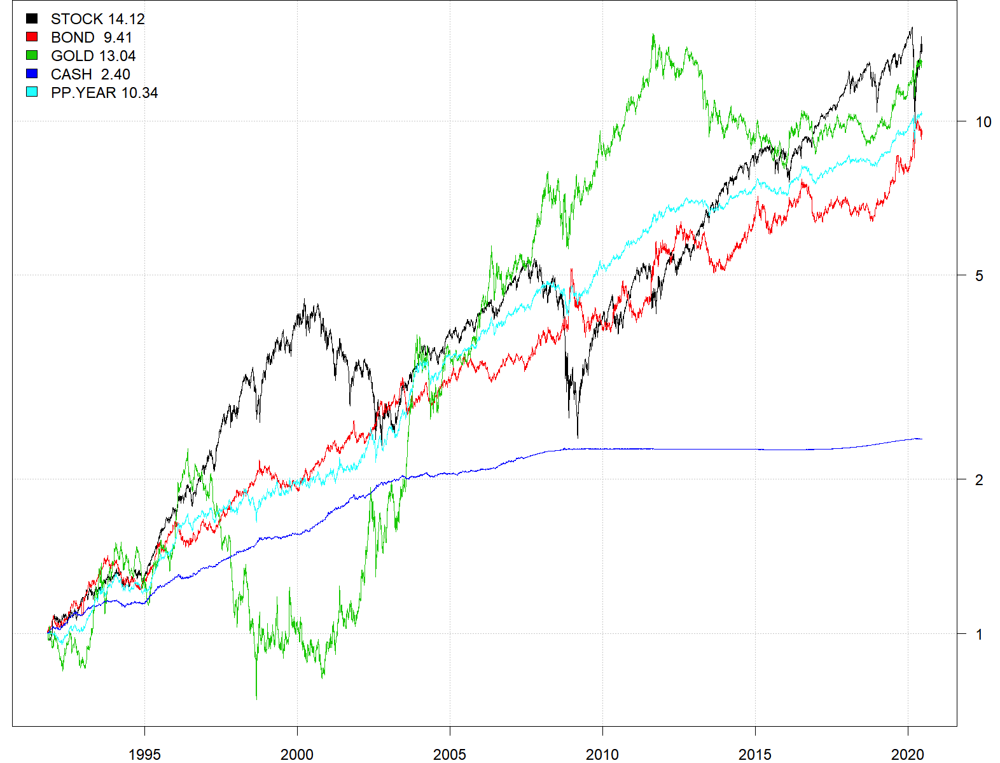

 

Harry Browne (1933-2006), était un écrivain de nationalité américaine, investisseur et fervent défenseur des libertés individuelles. Il publia en 1999 son ouvrage « Fail-Safe Investing », dans lequel il présente la stratégie du « Permanent Portfolio ».

La stratégie du Portefeuille Permanent (PP) repose sur un investissement dans les 4 classes d'actifs les plus pures qui existent en finance: les actions, les obligations, l'or et le cash. L'investissement doit être réalisé à parts égales sur ces 4 actifs et les poches rééquilibrées chaque année.

Pour une description plus détaillée de la stratégie du Portefeuille Permanent de Harry Browne, voir mon post.

La solidité du Portefeuille Permanent de Harry Browne repose principalement, à mon sens, sur le fait qu'il est investi sur les actifs financiers les plus purs et les plus décorrélés qui existent en finance :

- **25% en actions sur l’indice du marchés US**, où le capitalisme fonctionne encore à peu près.
- **25% en obligations à long-terme du Trésor US**, qui sont les seules obligations à jouer le rôle de valeur refuge quand l'économie souffre.
- **25% en or**, qui reste la meilleure assurance contre l'inflation monétaire car les états ne savent toujours pas "imprimer" de l’or.
- **25% en cash**

A l’exception du cash, chacun de ces 3 actifs peut devenir extrêmement volatile, quand il est considéré isolément. Néanmoins, leur volatilité respective est assez comparable et la décorrélation importante qui existe entre ces classes d’actifs va permettre au portefeuille global de rester relativement stable.

Dans nos simulations, considérons les scénarios d’investissements suivants :

- **PP.FIXED** : Une fois l’allocation initiale établie, aucun rééquilibrage n’est effectué entre les différentes poches d’actifs. Bref j’investis et puis j’oublie!
  

- **PP.YEAR** : Je ne veux pas trop m’embêter, je rééquilibre le portefeuille chaque fin d’année. Le minimum syndical!
  

- **PP.MONTH** : Je rééquilibre le portefeuille chaque fin de mois.
  

- **PP.RP.8** : Je rééquilibre le portefeuille chaque fin de mois en tenant compte de la volatilité de chacun des actifs afin de répartir équitablement le risque entre les poches (risk-parity). Je limite arbitrairement la volatilité globale du portefeuille à 8% en ajustant la proportion de l’allocation en cash.
  

- **PP.TIMING** : A l’image du « Quantitative Approach To Tactical Asset Allocation » de Mebane T. Faber, j’utilise une moyenne mobile à 10 mois et n’investis que sur les actifs qui ont un momentum positif. Les poches qui ont un momentum négatif sont désinvesties et allouées en cash. Je répète la sélection chaque fin de mois.
  

Pour simuler ces actifs, j’utilise les cours journaliers des trackers US les plus liquides. J’utilise également des fonds de placements plus anciens, afin d’augmenter l’historique des données disponibles. Cet assemblage me permet d’avoir des cours journaliers qui débutent en 10/1991, soient 30 ans de simulation.
  

 

Les simulations ont été réalisées avec le langage de programmation R.

Pour simplifier, il n’est pas tenu comptes des frais d’opérations, des écarts d’exécutions et des impôts.

Les cours d’entrée et de sortie sont les cours de clôture en fin de journée.

Voyons l’évolution historique des différents actifs qui composent le PP :
  

 

Et les leurs données statistiques correspondantes :
  

 

Première petite surprise, depuis le début des années 1990 à ce jour, les marchés de l’or et des actions ont eu des performances comparables. Néanmoins, le graphique de performance montre clairement que c’est un hasard car ces 2 actifs sont bien évidemment fortement décorrélés. Ils ont chacun tendance à bien performer à des moments différents.
  

<!-- PP.YEAR -->

<h5 class="alert alert-info text-center ">SIMULATION PP.FIXED</h5>

Une fois l’allocation initiale établie, aucun rééquilibrage n’est effectué entre les différentes poches d’actifs. Bref j’investis et puis j’oublie!

PP.FIXED

Performance cumulée et drawdown

PP.FIXED

Statistiques

PP.FIXED

Transitions

Les différentes poches de l'allocation PP. FIXED n'étant pas rééquilibrées entre-elles, on voit clairement la poche action devenir prépondérante et le cash ayant peu progressé devenir très marginal au fils du temps.

PP.FIXED

Table mensuelle

  

<!-- PP.YEAR -->

<h5 class="alert alert-info text-center ">SIMULATION PP.YEAR</h5>

Le Portefeuille Permanent classique. Les poches d’actifs sont rééquilibrées chaque fin d’années.

PP.YEAR

Performance cumulée et drawdown

PP.YEAR

Statistiques

PP.YEAR

Transitions

PP.YEAR

Table mensuelle

  

<!-- PP.MONTH -->

<h5 class="alert alert-info text-center ">SIMULATION PP.MONTH</h5>

Le Portefeuille Permanent mensuel. Les poches d’actifs sont rééquilibrées chaque fin de mois. La granularité de l’allocation est plus fine.

PP.MONTH

Performance cumulée et drawdown

PP.MONTH

Statistiques

PP.MONTH

Transitions

PP.MONTH

Table mensuelle

  

<!-- PP.RP.8 -->

<h5 class="alert alert-info text-center ">SIMULATION PP.RP.8</h5>

Le Portefeuille Permanent à parité des risques. Les poches d’actifs sont rééquilibrées chaque fin de mois et la taille de chacune des poches est calculée afin d’équilibrer les risques. La poche la plus volatile reçoit l’allocation la plus faible et la poche la moins volatile reçoit l’allocation la plus faible.  Ainsi équilibré chacune des poches contribue de façon égale à la performance globale du portefeuille. La volatilité du portefeuille est plafonnée par construction à 8%. Le cash n’est pas pris en compte dans le calcul des allocations. La poche cash reçoit les montants résiduels non-alloués pour maintenir le portefeuille sous 8% de volatilité.

PP.RP.8

Performance cumulée et drawdown

PP.RP.8

Statistiques

PP.RP.8

Transitions

PP.RP.8

Table mensuelle

  

<!-- PP.TIMING -->

<h5 class="alert alert-info text-center ">SIMULATION PP.TIMING</h5>

Cette allocation est similaire à l’allocation mensuelle à laquelle l’on ajoute un filtre de momentum, basé sur une moyenne mobile à 10 mois. Les poches qui ont un momentum négatif sont désinvesties et allouées en cash. La sélection est répétée chaque fin de mois. Cette approche s’inspire du « Quantitative Approach To Tactical Asset Allocation » de Mebane T. Faber.

PP.TIMING

Performance cumulée et drawdown

PP.MONTH

Statistiques

PP.MONTH

Transitions

PP.MONTH

Table mensuelle

  

<!-- COMPARAISON DES STRATEGIES -->

<h5 class="alert alert-info text-center ">COMPARAISON DES STRATEGIES</h5>

COMPARAISON DES STRATEGIES

Performances cumulées

COMPARAISON DES STRATEGIES

Statistiques

Au premier abord, les portefeuilles à rééquilibrage mensuel peuvent sembler les plus intéressants (PP.MONTH, PP.TIMING et PP.RP.8). Néanmoins, si vous prenez en compte les frais d’opérations et les écarts d’exécutions supplémentaires, occasionnés par une fréquence de rééquilibrage plus importante, alors la relative sur-performance ne compensera jamais ces coûts additionnels, qui peuvent facilement représenter entre 1% et 2% par an.

A mon sens, l’allocation PP.YEAR est la plus intéressante. Les rapports performance sur risque et temps de travail sur performance sont les plus favorables.

  

<!-- RESUME -->

<h5 class="alert alert-success text-center ">RESUME</h5>

RESUME DU PP.YEAR

Performances cumulées

COMPARAISON DES STRATEGIES

Statistiques

  
