 

[Harry Browne](https://en.wikipedia.org/wiki/Harry_Browne) (1933-2006), était un écrivain de nationalité américaine, investisseur et fervent défenseur des libertés individuelles. Il publia en 1999 son ouvrage ["Fail-Safe Investing"](https://www.amazon.com/gp/product/031226321X/) , dans lequel il présente la stratégie du « Permanent Portfolio".

L’objectif du Portefeuille Permanent (PP) est d’apporter une solution simple et efficace pour préserver la valeur d’une épargne accumulée et s’assurer que cette épargne pourra traverser les différentes crises économiques comme l’inflation, la récession, la déflation, le crash, voir la confiscation. La stratégie ne recherche pas la performance absolue, mais simplement la préservation d’une épargne et de son pouvoir d’achat, en investissant de manière prudente et raisonnable.

Pour y parvenir, la stratégie du PP repose sur un investissement dans les 4 classes d'actifs les plus pures qui existent en finance: les actions, les obligations à long terme, l'or et le cash. L'investissement doit être réalisé à parts égales sur ces 4 classes d’actifs et les poches rééquilibrée de temps à autre.

Un PP réalisé sur le marché américain depuis les années 1970 a généré un rendement annualisé moyen de 8% par an avec la plus mauvaise année à -5%. En déduisant l’inflation, le rendement annuel moyen net est autour de 5% par an depuis plus de 50 ans!

Pour une description plus détaillée de la stratégie du Portefeuille Permanent de Harry Browne, [voir mon post](https://nicofinanceblog/post/2020-01-31-autonomie-financiere-introduction-2/).

A mon sens, la solidité et l’efficacité du PP repose principalement sur le fait qu'il est composé exclusivement des actifs financiers les plus purs et les plus décorrélés qui existent dans le monde de la finance :

- **25% en actions sur l’indice globale du marché des USA**, où le capitalisme fonctionne encore à peu près.  

- **25% en obligations à long-terme du Trésor US**, qui sont les seules obligations à jouer le rôle de valeur refuge quand l'économie souffre.  

- **25% en or**, qui reste la meilleure assurance contre l'inflation monétaire, car les états ne savent toujours pas "imprimer" de l’or.  

- **25% en cash**

À l’exception du cash, chacun de ces 3 actifs peut devenir extrêmement volatile, quand il est considéré isolément. Néanmoins, leur volatilité respective à long terme est assez comparable et la décorrélation importante qui existe entre ces classes d’actifs va permettre au portefeuille global de rester relativement stable.

Si vous êtes un investisseur actif, la simplicité du PP est assez déconcertante, puisqu’il n’y a pour ainsi dire rien à faire. On serait tenté de penser qu’une allocation aussi simple puisse être facilement améliorée?

C’est ce que nous allons voir dans les simulations que je vous propose. Considérons un investissement unique avec les scénarios d’investissements suivants :

- **PP.FIXED** : une fois l’allocation initiale établie, aucun rééquilibrage n’est effectué entre les différentes poches d’actifs. Bref j’investis et puis j’oublie!  

- **PP.YEAR** : je ne veux pas trop m’embêter, je rééquilibre le portefeuille chaque fin d’année. Le minimum syndical!  

- **PP.MONTH** : je rééquilibre le portefeuille chaque fin de mois.  

- **PP.RP.8** : je rééquilibre le portefeuille chaque fin de mois en tenant compte de la volatilité de chacun des actifs afin de répartir équitablement le risque entre les poches (risk-parity). Je limite arbitrairement la volatilité globale du portefeuille à 8% en ajustant la proportion de l’allocation en cash.  

- **PP.TIMING** : à l’image du « [Quantitative Approach To Tactical Asset Allocation](https://papers.ssrn.com/sol3/papers.cfm?abstract_id=962461) » de Mebane T. Faber, on peut utiliser une moyenne mobile à 10 mois et n’investir que sur les actifs qui ont un momentum positif. Les poches qui ont un momentum négatif sont désinvesties et allouées en cash. Je répète la sélection chaque fin de mois.  

Pour simuler ces actifs, j’utilise les cours journaliers des trackers US les plus liquides. Afin d’augmenter l’historique des données disponibles, j’utilise des fonds de placement pour les données plus anciennes. Cet assemblage me permet d’avoir des cours journaliers qui débutent en 10/1991, soient 30 ans de simulation.  

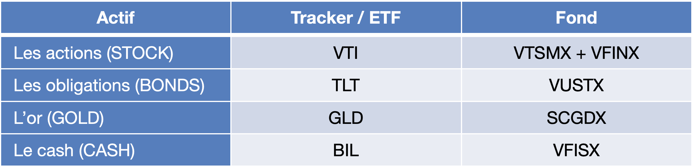 

Les simulations ont été réalisées avec le langage de programmation R.

Pour simplifier, il n’est pas tenu compte des frais d’opérations, des écarts d’exécutions et des impôts.

Les cours d’entrée et de sortie sont les cours de clôture ajustés des dividendes, c’est-à-dire que les dividendes sont réintégrés dans les cours.

Voyons l’évolution historique des différents actifs qui composent le PP : 

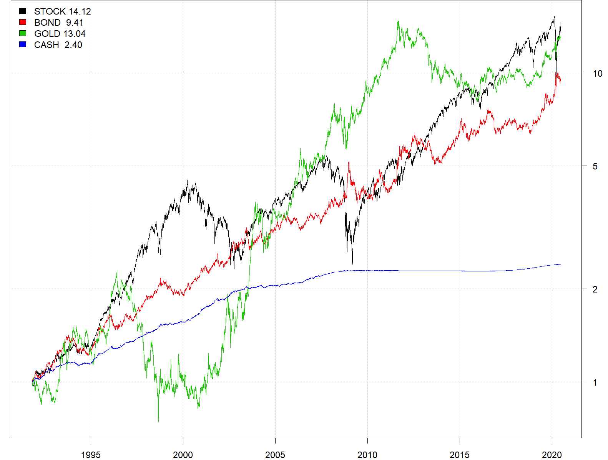 

Et les leurs données statistiques correspondantes : 

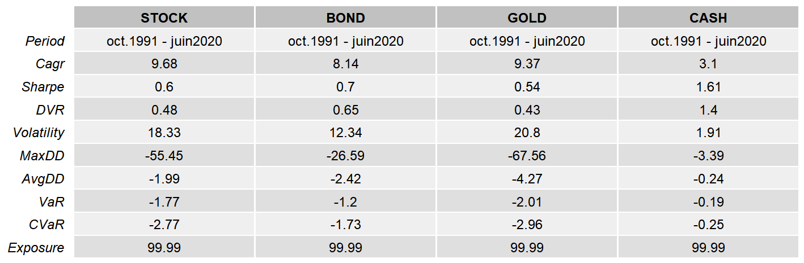 

Première petite surprise, depuis le début des années 1990 à ce jour, les marchés de l’or et des actions ont eu des performances comparables. Néanmoins, le graphique de performance montre clairement que c’est un hasard, car ces 2 actifs sont fortement décorrélés. Ils ont chacun tendance à bien performer à des moments différents.  

<!-- PP.FIXED -->

<h5 class="alert alert-info text-center ">SIMULATION PP.FIXED</h5>

Une fois l’allocation initiale établie, aucun rééquilibrage n’est effectué entre les différentes poches d’actifs. Bref, j’investis et puis j’oublie!

PP.FIXED

Performance cumulée et drawdown

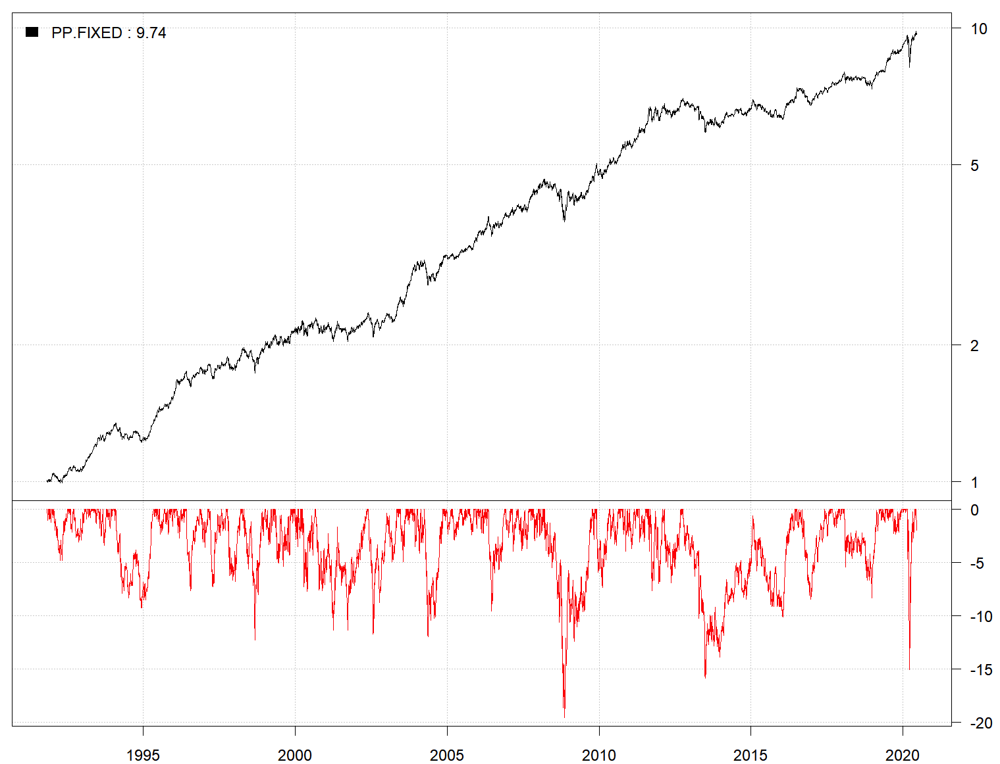

PP.FIXED

Statistiques

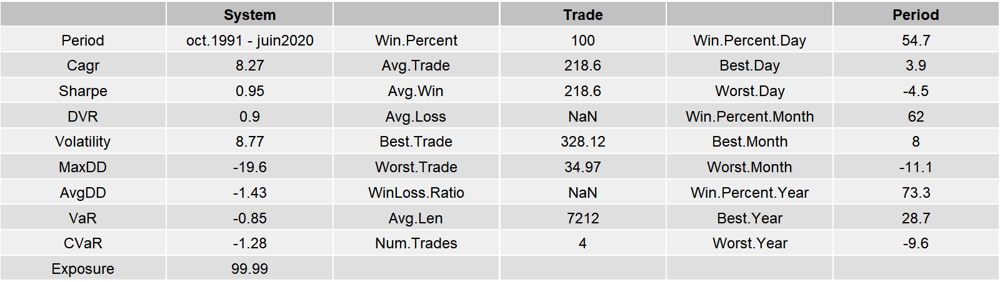

PP.FIXED

Transitions

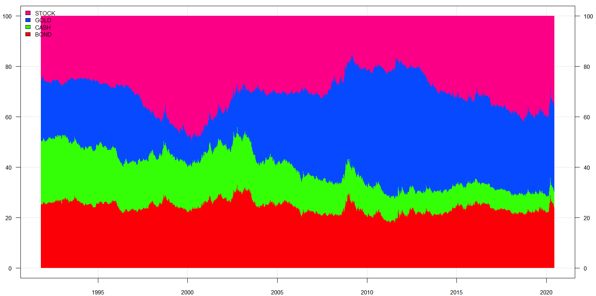

Les différentes poches de l'allocation PP.FIXED n'étant jamais rééquilibrées entre-elles, on voit clairement l’évolution des différentes classes d’actifs. Sans surprise, la poche cash qui est très faiblement rémunératrice va devenir très marginale au fil du temps.

En ce qui concerne les 3 autres classes d’actifs, bien que lentes, les fluctuations peuvent être extrêmement importantes. Parti de 25% au départ de l’allocation globale du PP en 1991, l’or est réduit à presque rien au plus fort de la bulle internet des années 2000, alors que les actions représenteront près de 50% de la valeur totale du portefeuille. Après la bulle, la situation s’inverse totalement et l’or progresse énormément, pour à son tour représenter près de 50% de la valeur totale du portefeuille en 2010 et les actions revenir à 20%.

Ce graphique permet de comprendre pourquoi il est nécessaire de rééquilibrer les poches dur PP de temps à autre. La stratégie du PP profite de la plus-value des actifs qui ont le plus progressé pour se placer à bon compte sur les actifs qui ont baissé, ou si vous préférez sont devenus meilleur marché.

PP.FIXED

Table mensuelle

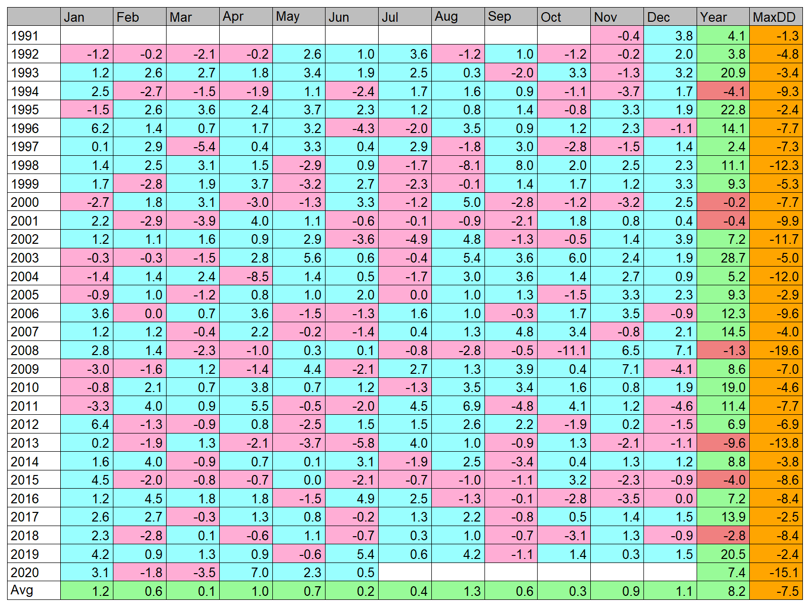

  

<!-- PP.YEAR -->

<h5 class="alert alert-info text-center ">SIMULATION PP.YEAR</h5>

Le Portefeuille Permanent classique. Les poches d’actifs sont rééquilibrées chaque fin d’années.

PP.YEAR

Performance cumulée et drawdown

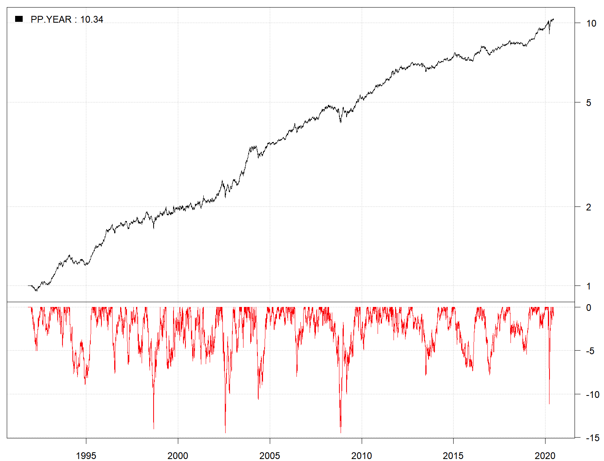

PP.YEAR

Statistiques

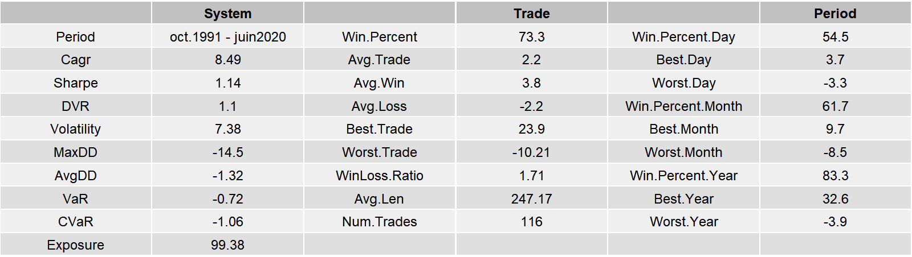

PP.YEAR

Transitions

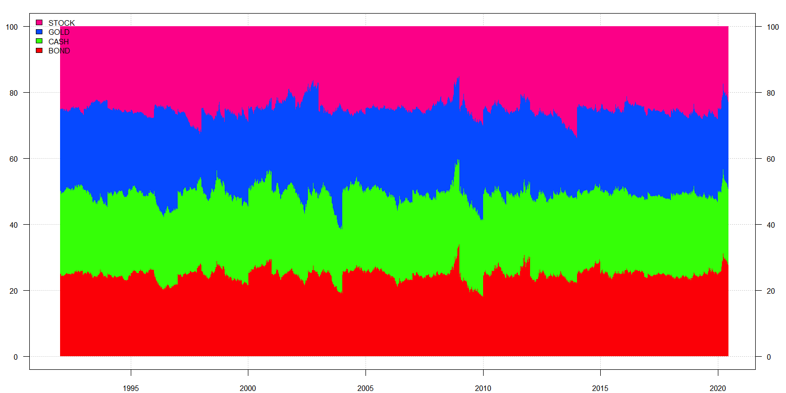

PP.YEAR

Table mensuelle

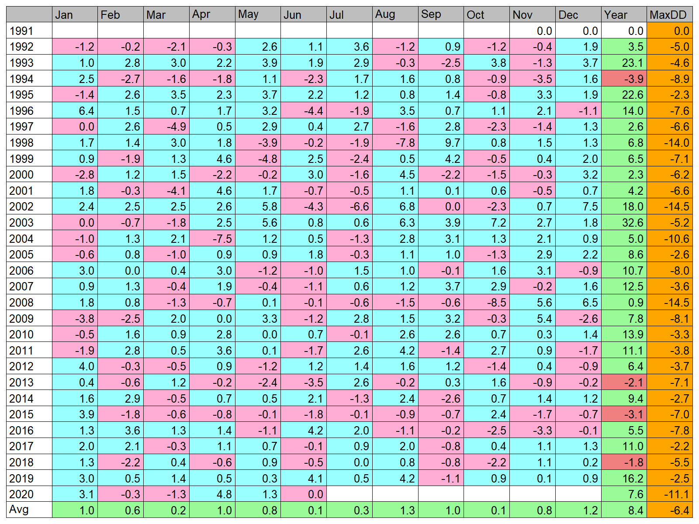

  

<!-- PP.MONTH -->

<h5 class="alert alert-info text-center ">SIMULATION PP.MONTH</h5>

Le Portefeuille Permanent mensuel. Les poches d’actifs sont rééquilibrées chaque fin de mois. La granularité de l’allocation est théoriquement plus fine.

PP.MONTH

Performance cumulée et drawdown

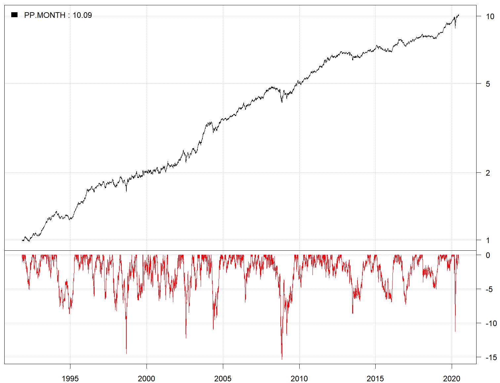

PP.MONTH

Statistiques

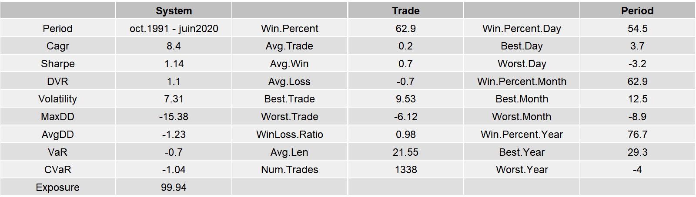

PP.MONTH

Transitions

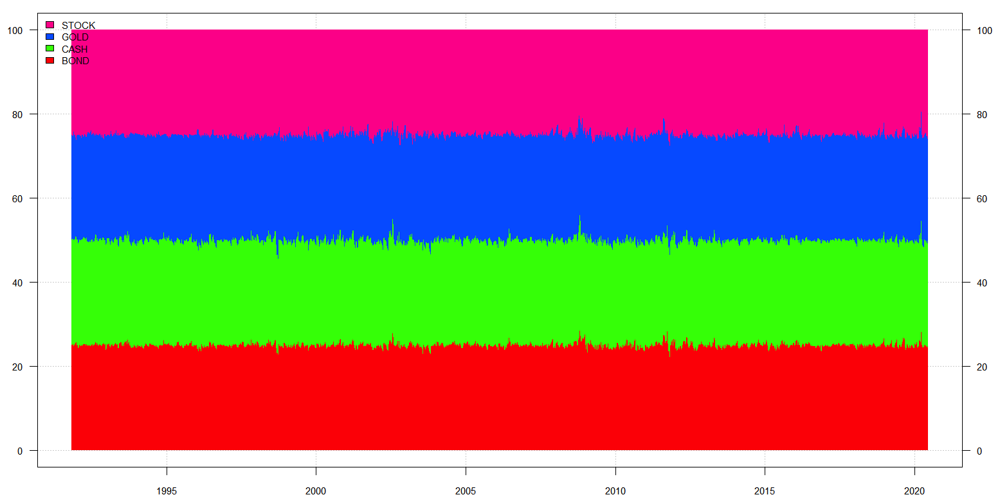

PP.MONTH

Table mensuelle

  

<!-- PP.RP.8 -->

<h5 class="alert alert-info text-center ">SIMULATION PP.RP.8</h5>

Le Portefeuille Permanent à parité des risques. Les poches d’actifs sont rééquilibrées chaque fin de mois et la taille de chacune des poches est calculée afin d’équilibrer les risques. La poche la plus volatile reçoit une allocation plus faible et la poche la moins volatile reçoit une allocation plus importante. Ainsi équilibrée chacune des poches contribue équitablement à la performance globale du portefeuille. La volatilité du portefeuille est plafonnée par construction à 8%. Le cash n’est pas pris en compte dans le calcul des allocations, il reçoit simplement les montants résiduels non-alloués lorsque que les proches à risque doivent être plafonnées pour maintenir la volatilité du portefeuille sous 8%.

PP.RP.8

Performance cumulée et drawdown

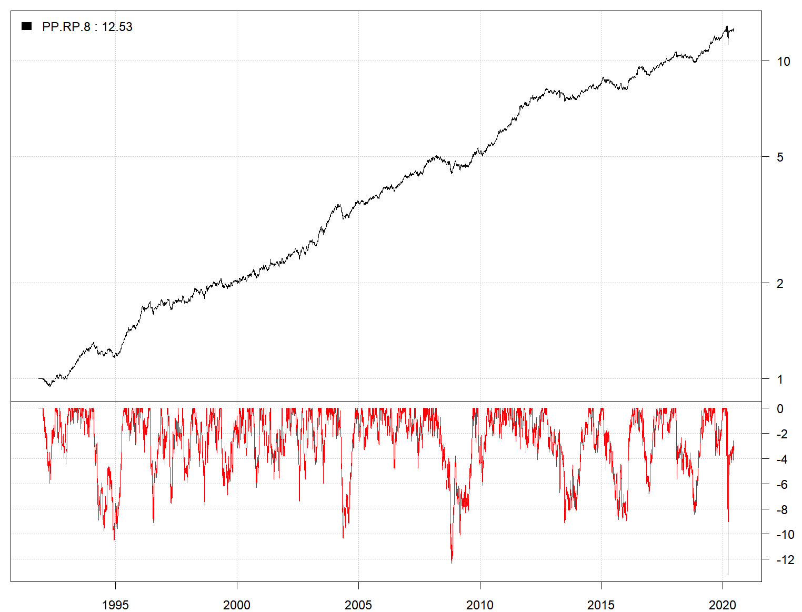

PP.RP.8

Statistiques

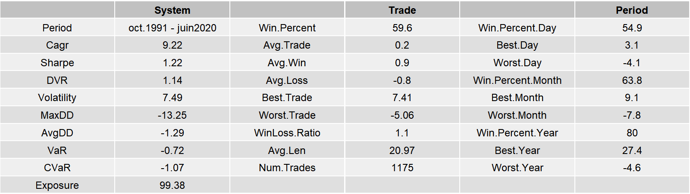

PP.RP.8

Transitions

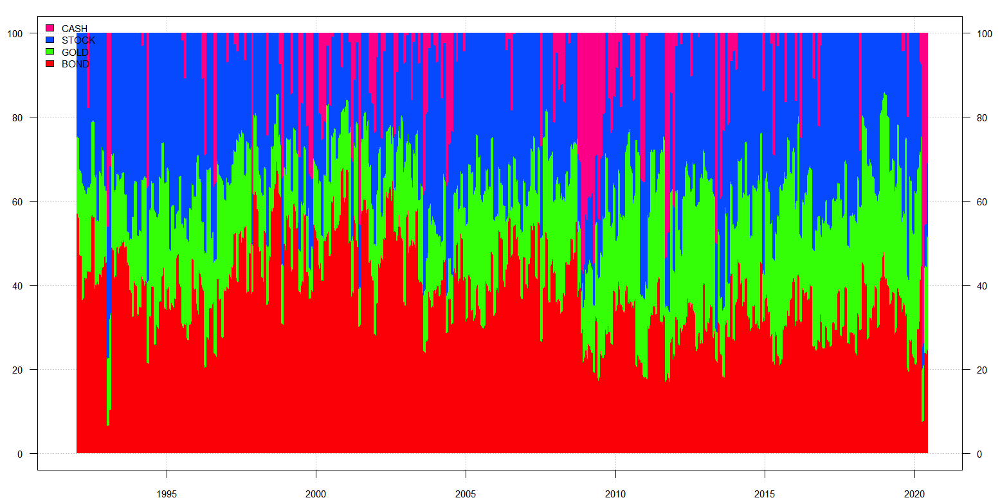

PP.RP.8

Table mensuelle

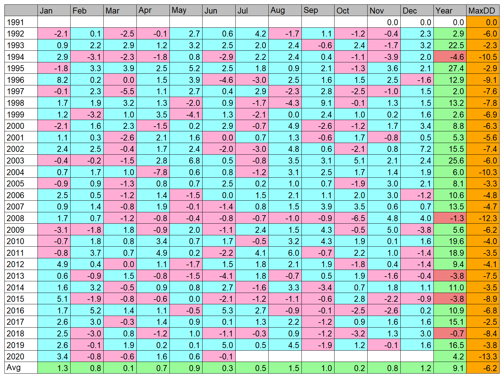

  

<!-- PP.TIMING -->

<h5 class="alert alert-info text-center ">SIMULATION PP.TIMING</h5>

Cette allocation est similaire à l’allocation mensuelle, à laquelle l’on ajoute un filtre de momentum, basé sur une moyenne mobile à 10 mois. Les poches qui ont un momentum négatif sont désinvesties et allouées en cash. La sélection est répétée chaque fin de mois. Cette approche s’inspire du « [Quantitative Approach To Tactical Asset Allocation](https://papers.ssrn.com/sol3/papers.cfm?abstract_id=962461) » de Mebane T. Faber pour ceux d’entre vous qui connaissent.

PP.TIMING

Performance cumulée et drawdown

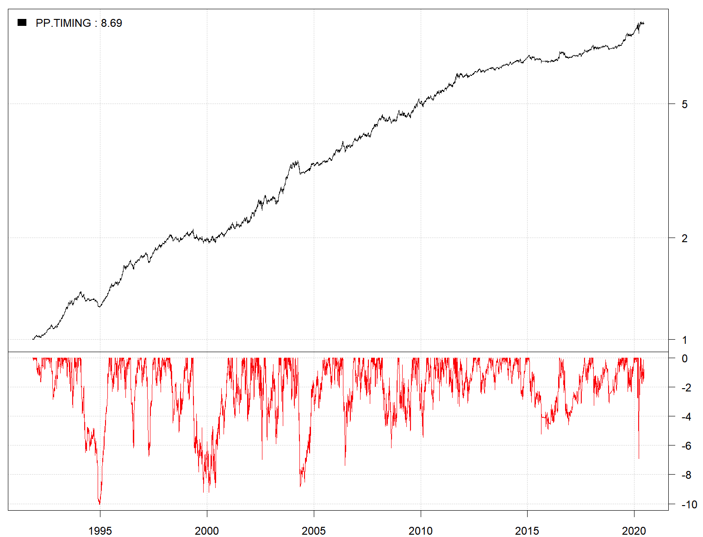

PP.TIMING

Statistiques

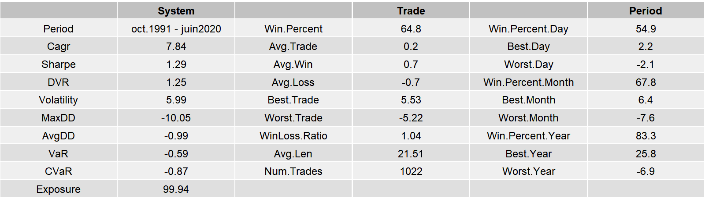

PP.TIMING

Transitions

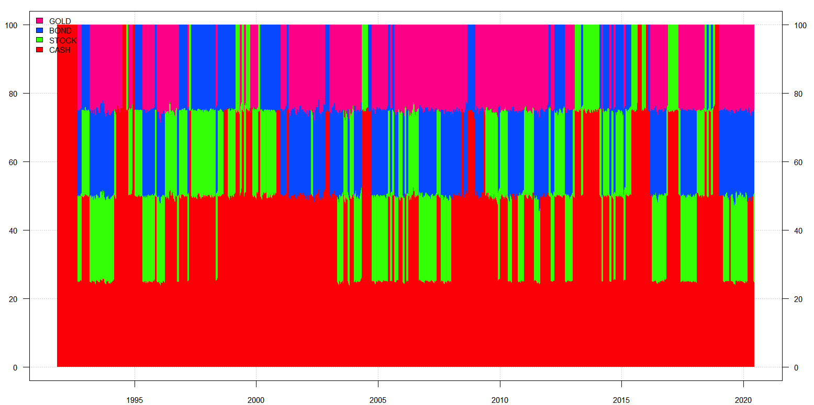

PP.TIMING

Table mensuelle

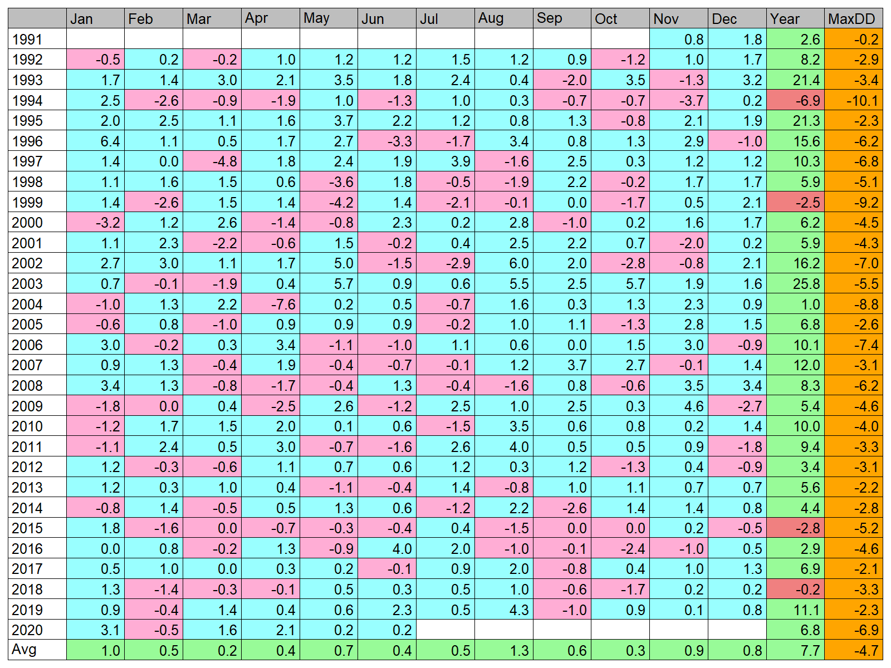

  

<!-- COMPARAISON DES STRATEGIES -->

<h5 class="alert alert-info text-center ">COMPARAISON DES STRATÉGIES</h5>

COMPARAISON DES STRATÉGIES ENTRE-ELLES

Performances cumulées

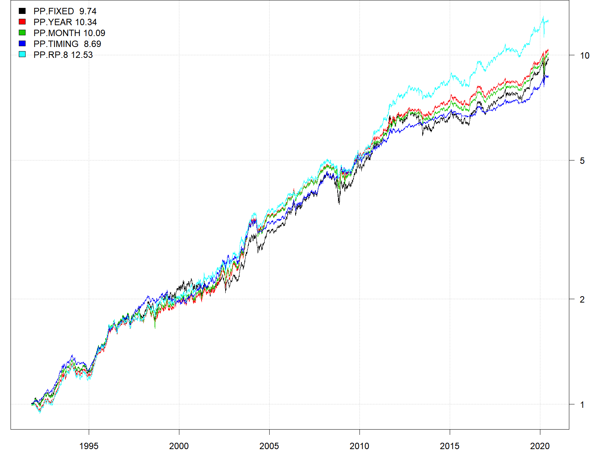

COMPARAISON DES STRATÉGIES ENTRE-ELLES

Statistiques

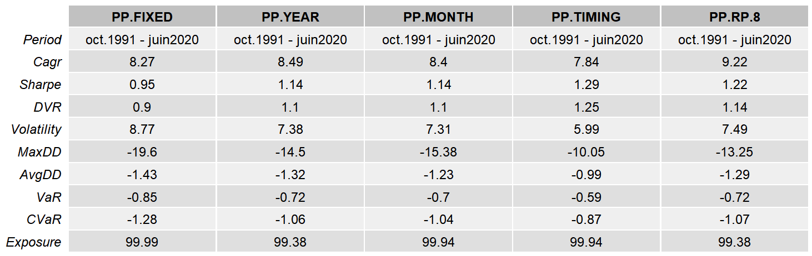
 

Un facteur important à prendre en compte, qui n’apparaît pas dans mes simulations, est la fréquence de rotation des stratégies. C’est-à-dire le nombre d’arbitrages que vous allez devoir réaliser chaque année. Plus le nombre d’opérations est important, plus les frais de frottement (frais de courtage, écart d’exécution, taxes) vont venir réduire votre performance brute.

Au premier abord, les portefeuilles à rééquilibrage mensuel peuvent sembler les plus intéressants (PP.MONTH, PP.TIMING et PP.RP.8). Néanmoins, si vous prenez en compte le surcoût d’une rotation plus importante, alors la relative sur-performance ne compensera jamais ces coûts additionnels.

Le PP.YEAR ne demande qu’un seul rééquilibrage par an et encore, uniquement si les poches sont significativement déséquilibrées, disons de +/-10%. À l’inverse, les stratégies à ré-allocation mensuelle, demanderont quant à elles, une douzaine d’opérations par an. Ce surcoût opérationnel peut facilement réduire la performance brute annuelle de 1% à 2%. Sans considérer par ailleurs, le temps de travail supplémentaire que cela va occasionner.

À mon sens, l’allocation PP.YEAR est la plus intéressante. Les rapports performance sur risque et performance sur temps de travail, sont les plus favorables.

On peut quand même tirer quelques conclusions de ces simulations:

- Toutes les approches fonctionnent, qu’elles soient actives ou pas.  

- La faible dispersion entre les différentes approches provient de la structuration même du PP, qui est construit avec les actifs les plus purs et les plus décorrélés qui existent en finance. Ces actifs ont des volatilités assez comparables sur le long terme, ainsi leurs volatilités respectives se compensent assez bien. Ce qui explique par ailleurs que l’allocation à parité des risques PP.RP.8 n’améliore que marginalement le PP.YEAR. De plus, cette amélioration n’est que théorique, car si vous prenez en compte les coûts de rotations supplémentaires, le PP.YEAR reprend le dessus.  

- Le PP.TIMING nous montre que nous pouvons alléger l’allocation d’un actif, si ce dernier est dans une tendance baissière bien établie. J’ai utilisé une moyenne mobile à 10 mois, mais tout indicateur de momentum supérieur à 6 mois fonctionnera parfaitement. Il s’agit simplement détecter les tendances économiques de long terme.  

**Mais attention, ce genre d’arbitrage sur le PP, c’est un peu ouvrir la boite de Pandore.** Il faut comprendre que le portefeuille absorbe bien la plupart des chocs financiers, car il est investi en permanence sur les 2 seuls actifs financiers sur lesquels les investisseurs se réfugient lors d’un choc économique, à savoir l’or ou les obligations à long terme du Trésor US. Malheureusement, il est impossible de prévoir à l’avance sur lequel de ces 2 actifs les investisseurs choisiront de se réfugier. Il est donc préférable d’avoir une allocation minimum incompressible et permanente sur chacun de ces 2 supports. Même si dans le cas de l’or, la sous-performance peut facilement durer une décennie. Ainsi quand l’or est en tendance baissière, vous pourriez n’y allouer que 12,5% au lieu des 25% prévu par le PP.

D’un point de vue pratique, je pense qu’il est préférable de maintenir un PP classique, c’est-à-dire à rééquilibrage annuel (PP.YEAR) et ne pas chercher à le modifier. Rien ne vous empêche de construire en parallèle d’autres portefeuilles, alloués à des stratégies plus dynamiques, afin d’améliorer la diversification de votre patrimoine financier.

**Utilisez le Portefeuille Permanent de Harry Browne pour ce dont il a été construit : être une stratégie de gestion simple et efficace, pour préserver une épargne de précaution sur le long terme.**

  

<!-- RESUME -->

<h5 class="alert alert-success text-center ">COMPARATIF ACTIFS ET PP.YEAR</h5>

COMPARATIF DES ACTIFS ET DU PP.YEAR

Performances cumulées

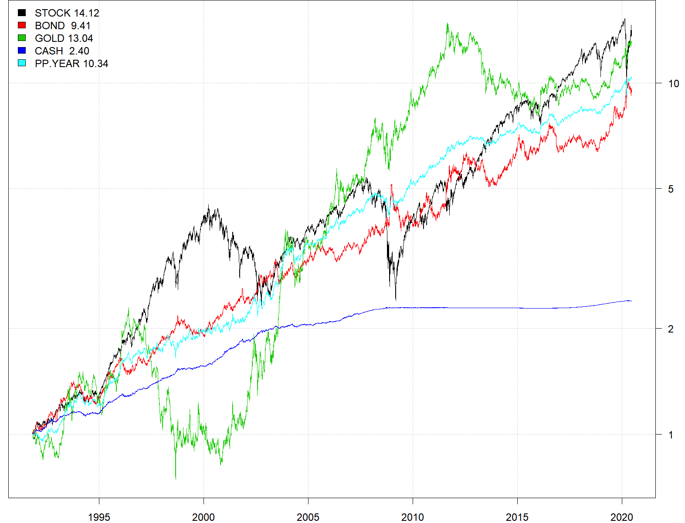 

Au final l'allocation du PP.YEAR apparait comme un havre de paix "relative" dans une mer d'actifs très agités.  

COMPARATIF DES ACTIFS ET DU PP.YEAR

Statistiques

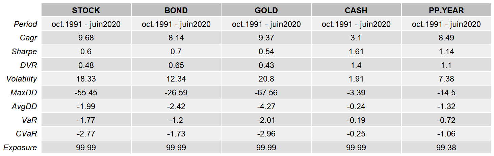

COMPARATIF DRAWDOWNS ACTIONS ET PP.YEAR

Comparatifs des drawdowns

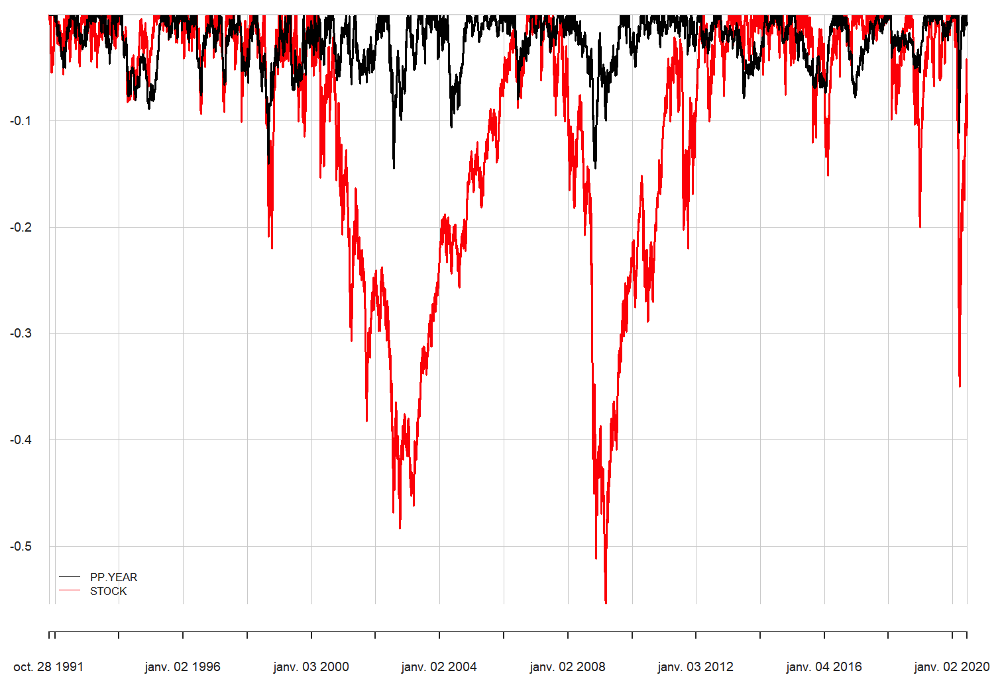

TOP 10 DRAWDOWNS HISTORIQUES

Marchés des actions US

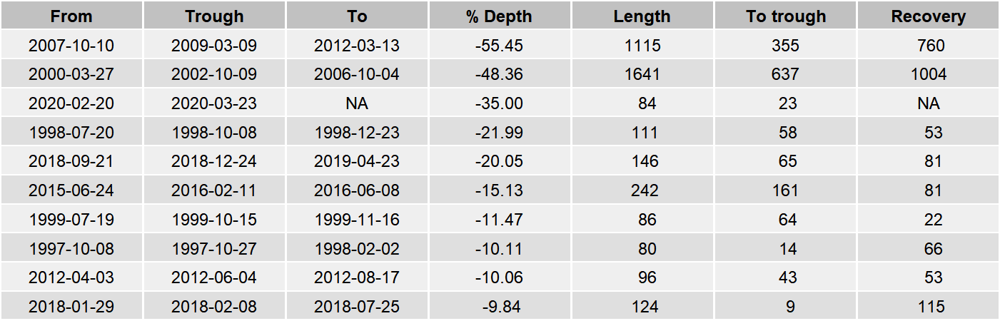

TOP 10 DRAWDOWNS HISTORIQUES

Allocation PP.YEAR

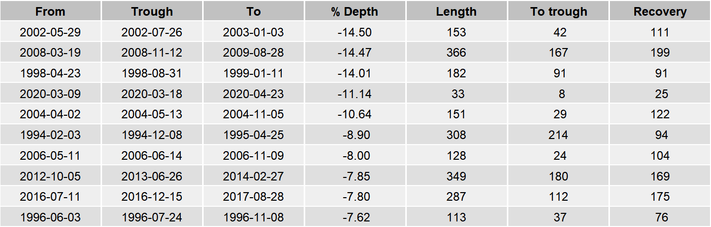
 

_Publié le 17 juin 2020 © Nicolas Lequeux_

  

<!-- LIENS -->

Si vous voulez une introduction au Portefeuille Permanent de Harry Browne.

https://www.nicofinance.blog/post/2020-01-31-autonomie-financiere-introduction-2/

Si vous souhaitez connaitre les trackers accessibles aux investisseurs européens pour investir sur le Portefeuille Permanent US.

https://www.nicofinance.blog/post/2020-03-15-liste-trackers/

Vous pouvez suivre l’évolution du PP.YEAR depuis ce lien ou simuler une allocations avec ce simulateur.

https://www.nicofinance.blog/strategies

https://nicolaslequeux.shinyapps.io/nlx-pp-input/

