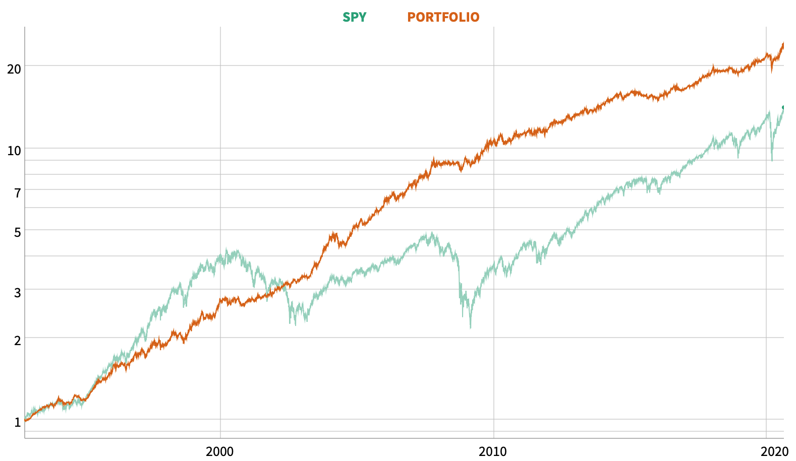

 

#### Comment améliorer la performance d’une stratégie d’investissement, simplement et efficacement
 

Après que nous ayons vu le [Portefeuille Permanent de Harry Browne](https://www.nicofinance.blog/post/2020-01-31-autonomie-financiere-introduction-2/)¹ (PP), je vais vous montrer comment celui-ci peut être associé à des stratégies actives, afin de constituer un portefeuille financier globalisé, performant et solide.

Pour rappel, le PP (Portefeuille Permanent de Harry Browne) est une allocation passive, qui repose sur les actifs les plus purs et les plus décorrélés qui existent en finance : le marché des actions, les obligations d’Etat US à long terme, l’or et le cash. L’investissement doit être réalisé à parts égales sur ces 4 actifs et les poches rééquilibrées de temps à autre. La beauté de cette allocation est qu’elle n’essaie pas de prédire l’évolution future de l’économie pour savoir sur quel actif investir. Elle maintient simplement une allocation équilibrée entre des actifs qui performeront favorablement à tour de rôle, en fonction du cycle économique ambiant (prospérité, inflation, récession, déflation). Des ETF adaptés au PP sont le VTI, TLT, GLD et BIL.

 

Performance du PP en comparaison avec le S&P500

 

Le PP performe admirablement bien, car il profite de la décorrélation importante qui existe entre les 4 actifs qui le composent. **Il réalise une performance assez proche du S&P500, mais avec beaucoup moins de risque, de volatilité.**

Si nous voulons améliorer la performance de notre PP, l’idéal est d’y ajouter un cinquième actif décorrélé. Ainsi, nous aurions un moteur de croissance supplémentaire. **Malheureusement, ce cinquième actif, décorrélé des actions, des obligations, de l’or et du cash, n’existe pas !**

Et l'immobilier me direz-vous?

L’immobilier n’est pas un actif décorrélé. Un investissement immobilier est dépendant du niveau des taux d’intérêt à long terme et de la croissance économique. L’immobilier aura tendance à prendre de la valeur quand l’économie se porte bien (ou que les taux baissent) et à en perdre dans les périodes de récession (ou quand les taux remontent). C’est donc un actif hybride qui est une composition du marché des actions et des taux d’intérêt.

Il en est de même pour la plupart des actifs auxquels vous pourriez penser, voitures de collection, vins, marché de l’art, forêts… Ils dépendent intrinsèquement de la santé globale de l’économie et vont la plupart du temps s’apprécier ou se déprécier en même temps.

**Une solution qui s’offre à nous et de “simuler” ce cinquième actif décorrélé, au travers de l’utilisation de stratégies d’investissements actives.**

Les stratégies d’investissements actives sont des stratégies donc l’allocation n’est pas figée. Elles peuvent entrer et sortir des marchés à tout moment, se repositionner sur des marchés différents, en fonction des opportunités du moment et parfois jouer la hausse comme la baisse. Le fait qu’elles soient actives va introduire une forme de décorrélation par rapport à un investissement figé comme notre PP.

***L’ajout de stratégies d’investissements actives et décorrélées du Portefeuille Permanent peut permettre d’améliorer la performance globale de notre portefeuille, sans pour autant augmenter le risque.***

Pour ma démonstration, je vais utiliser les 2 stratégies actives suivantes :

- Le GEM (Global Equity Momentum²) de Garry Antonacci

- Le VAA (Vigilant Asset Allocation³) de Wouter Keller and JW Keuning

 

#### Résumé simplifié du GEM

[Dual Momentum Investing: An Innovative Strategy for Higher Returns with Lower Risk](https://www.amazon.com/Dual-Momentum-Investing-Innovative-Strategy/dp/0071849440)

Le GEM est une stratégie bien connue des investisseurs actifs et relativement tranquille, qui réalise en moyenne 2 à 3 opérations par an.

La stratégie investit à 100%, soit sur le marché des actions US, soit sur le marché des actions étrangères hors USA. Le critère de sélection est le momentum à 12 mois. Chaque fin de mois, la stratégie investit sur le marché qui a le momentum le plus élevé. Si aucun momentum n’est positif, alors la stratégie est désinvestie du marché des actions, pour être investie dans un panier d’obligations faiblement risquées, le temps que le marché des actions redevienne favorable pour y retourner. Les obligations jouent ainsi le rôle de position d’attente quand le marché action n’est pas en croissance. La stratégie utilise idéalement les ETF : SPY, VEU, AGG.

En moyenne, la stratégie réalise 2 à 3 opérations d’arbitrages par an. Quand le marché est dans une tendance solide, la stratégie peut rester investie plusieurs années sans qu’il y ait lieu de procéder à la moindre opération d’arbitrage.

 

Performance du GEM en comparaison avec le S&P500

 

#### Résumé simplifié du VAA

[Breadth Momentum and Vigilant Asset Allocation (VAA):  Winning More by Losing Less](https://papers.ssrn.com/sol3/papers.cfm?abstract_id=3002624)

Le VAA est une stratégie plus récente qui appartient à la famille des stratégies smart beta⁴ modernes. C’est-à-dire qu’elle a la prétention de faire mieux qu’un investissement passif, en faisant usage d’un plus grand nombre d’arbitrages, qui peuvent être aussi parfois plus offensifs, comme investir sur des marchés de niche.

La stratégie VAA surveille le momentum de 4 marchés globaux distincts : le marché des actions US, des pays développés hors USA, des pays émergents et des obligations globales US. Si ces 4 marchés ont tous un momentum positif, alors la stratégie est investie à 100% sur le marché qui à le momentum le plus élevé. La sélection est répétée chaque fin de mois. Dès qu’un seul de ces marchés (ou plusieurs) a un momentum négatif en fin de mois, la stratégie sort du marché risqué des actions et bascule à 100% en obligations, soient les obligations d’entreprises, soient les obligations d’Etat à moyen terme, soit le cash, là aussi en se basant sur le critère du momentum pour choisir le support sécurisé le plus performant du moment.

Le momentum du VAA est calculé d’une façon différente de celui du GEM, ce qui permet d’avoir des points de bascules différents dans le temps. Cette différence va participer à améliorer la décorrélation entre les 2 stratégies, qui exploitent toutes les deux, la technique du momentum.

Pour information, le VAA utilise une moyenne pondérée des momentums à 1, 3, 6, et 12 mois, calculée de la façon suivante :

**Mom = [ (12 x M1) + (4 x M3) + (2 x M6) + (M12) ] / ( 12 + 4 + 2 + 1)**

Ce momentum accorde simplement plus de poids aux mois les plus récents. Il sera donc plus sensible aux mouvements de marché à court terme, mais aussi plus sensible aux faux signaux.

Le VAA est une stratégie moyennement active, qui nécessite au maximum une opération par mois. Elle fuit les marchés au moindre craquement en surveillant le comportement de plusieurs marchés à la fois. Elle peut rentrer et sortir très vite du marché. Ainsi, elle va généralement assez bien détecter et exploiter les cycles économiques de court-terme. La stratégie utilise idéalement les ETF: VOO, VEA, VWO, BND, LQD, IEF, SHY.

 

Performance du VAA en comparaison avec le S&P500

 

#### Composition des stratégies

 

Nous devons maintenant construire notre portefeuille avec ces 3 stratégies et définir les montants à leur allouer.

Nous allons utiliser pour cela une méthode de “risk parity⁵”, où nous définirons les montants à allouer sur chacune de ces stratégies, en se basant sur leur volatilité respective, qui est un proxy acceptable pour mesurer leur risque. La stratégie la moins volatile recevra l’allocation la plus importante et inversement la stratégie la plus volatile, l’allocation la plus faible. Il s’agit ici de répartir les montants investis de façon à ce que chacune des stratégies ai une contribution comparable en termes de risque au sein de notre portefeuille global.

 

Par exemple, le PP a une volatilité environ deux fois plus faible que celle du GEM (7.5% contre 14.5%). Je dois donc investir 2 fois plus sur le PP que sur le GEM si je veux que les risques entre ces 2 stratégies soient équilibrés. Ainsi, pour un investissement de 100€, je dois allouer 66€ au PP et 33€ à GEM (à peu près), le risque est ainsi, équitablement réparti: 66€ x 7,5% = 33€ x 14,5%

***Cette méthode d’équilibrage des allocations n’est pas une science exacte, mais elle va simplement permettre de réduire les disparités dans la répartition des risques et de s’assurer que chacune des stratégies contribue équitablement à la croissance de notre portefeuille.***

 

#### Backtest de notre portefeuille final

 

Notre portefeuille sera donc ainsi constitué :

 

Le PP constitue la colonne vertébrale de notre portefeuille, car il s’agit d’une allocation fixe, permanente, auxquels viennent s’ajouter les allocations actives GEM et VAA, qui peuvent être investies tantôt sur les marchés actions, tantôt en position d’attente sur les marchés obligataires, ou même en cash.

Le GEM et le VAA demandent une surveillance mensuelle, idéalement chaque fin de mois, afin de contrôler s’il y a lieu de modifier leurs allocations. Au final le portefeuille sera assez peu actif, car le PP est fixe, le GEM réalise en moyenne 2–3 opérations par an et le VAA en moyenne 10.

Afin de réaliser ce back-test, je vais utiliser une application que j’ai développée, qui permet de fusionner aisément des stratégies entre-elles.

L’application est disponible en ligne:

## Portfolio Builder ©##

 

Pour simplifier, il n’est pas tenu compte des frais de courtage, des écarts d’exécutions et des impôts et taxes. Les cours d’entrée et de sortie sont les cours de clôture ajustés des dividendes, c’est-à-dire que les dividendes sont réintégrés dans les cours.

 

Performance de notre Portefeuille en comparaison avec le S&P500

 

PComparaison des drawdowns de notre Portefeuille et du S&P500

 

Statistiques du portefeuille et des stratégies qui le composent

 

Le CAGR⁶ est le rendement annualisé moyen. Il est égal au rendement moyen des stratégies qui composent notre portefeuille, pondéré de la taille des allocations. Il ressort pour notre portefeuille ainsi constitué à +12,09% !

La volatilité à 8,32% est proche de la stratégie qui a la volatilité la plus faible, soit le PP avec 7,43%. En comparaison le GEM et le VAA ont chacun des volatilités bien plus importantes.

L’indicateur de Drawdown (perte maximum supportée par la stratégie) est révélateur de l’efficacité, à composer des stratégies décorrélées entre-elles.

***Le Drawdown de notre portefeuille s’établit à -12,75% soit moins que le drawdown de chacune des stratégies qui le composent !***

Le drawdown du PP est à -14,95%, le GEM à -33,72% et le VAA à -20,22%.

La raison en est, que lorsqu’une stratégie est en drawdown, les autres stratégies qui sont décorrélées, ne sont pas forcément elles, en drawdown. Elles vont alors venir réduire la perte de la stratégie en drawdown.

Le raisonnement est le même pour l’indicateur de perte mensuelle la plus importante (Worst Month). La perte mensuelle maximum passée du portefeuille ressort à -7,20% (avril 2004), soit significativement moins que la perte mensuelle maximum passée de chacune des 3 stratégies. Même chose pour l’année la plus mauvaise (Worst Year).

L’année la plus mauvaise depuis 30 ans n’est qu’à -3% en 2015 !

***En fait, tous les indicateurs de mesure du risque sont significativement améliorés !***

Vous avez là, les bénéfices à associer des stratégies bien diversifiées entre elles.

 

Performance mensuelle de notre Portefeuille

 

Seules 2 années sont très faiblement négatives : -2% en 2000 et -3% en 2015 !

 

Historique des drawdowns les plus importants (données journalières)

 

Evolution des différentes classes d’actifs qui composent notre Portefeuille

 

Comparaison de la performance de notre portefeuille avec les principales classes d’actifs S&P500 (SPY) — Obligations (AGG) — Or (GLD)

 

#### Pourquoi cette approche est-elle aussi performante?

 

Notre portefeuille performe admirablement bien, car les 3 stratégies qui le composent (PP, GEM et VAA) sont décorrélées entre elles.

La décorrélation dans notre portefeuille existe à plusieurs niveaux:

- Au travers du PP, qui est constitué des actifs les plus purs, les plus simples et les plus décorrélés qui existent en finance.

 

- Au travers des stratégies GEM et VAA, qui introduisent de nouvelles classes d’actifs, non-présentes dans le PP (marchés étrangers développés, marchés émergents, obligations d’entreprises, obligations d’Etat à moyen terme)

 

- Au travers des méthodes de sélection des actifs, qui sont différentes pour le GEM et le VAA. Le GEM utilise un momentum lent à 12 mois alors que le VAA utilise un momentum rapide. Ainsi, elles seront bien souvent chacune investie sur des actifs différents.

 

- Au travers du timing, GEM et VAA vont basculer d’une classe d’actif à une autre, à des moments différents, du fait de la différence de sensibilité dans le calcul du momentum.
Ces artifices nous permettent de générer des moteurs de performance (PP, GEM, VAA) assez bien décorrélés entre eux.

 

Enfin, en cas de choc économique ou financier, important et brusque, les allocations permanentes du PP en Obligations d’Etat US à long-terme et en or, vont venir soutenir le portefeuille global et atténuer les chocs, le temps que le mauvais temps passe.

 

#### Notes complémentaires

 

Une difficulté ou faiblesse peut être soulignée en ce qui concerne les 2 stratégies actives (GEM et VAA) utilisées pour ma démonstration. Ces 2 allocations sont mises à jour chaque fin de mois, c’est-à-dire à des fréquences et dates identiques. Il n’est pas évident, techniquement et psychologiquement, de basculer 55% de la valeur totale d’un portefeuille sur une seule journée. Une façon de résoudre cette difficulté et d’améliorer encore un peu plus la diversification, est par exemple, de procéder à la ré-allocation du GEM le 15 du mois et garder le VAA en fin de mois.

Ainsi, nous avons :

- Le PP, une allocation fixe qui demande à être rééquilibrée une seule fois en fin d’année.

 

- Le GEM, qui doit être contrôlé aux environs du 15 du mois pour savoir s’il y a lieu d’intervenir ou pas. Sachant qu’en moyenne, il n’y a que 2–3 opérations par an.

 

- Le VAA, qui doit être contrôlé chaque fin de mois, car son allocation change quasiment tous les mois.

 

- Les montants alloués à chacune des stratégies (45% PP + 25% GEM + 30% VAA) devront être, eux aussi, rééquilibrés de temps à autre, si la dispersion devient trop importante.
Au global le portefeuille est assez peu actif, je n’en suis pas esclave ou soumis à un stress incessant. Je peux d’ailleurs bien louper quelques arbitrages dans l’année sans que cela prête à conséquence.

 

D’un point de vue pratique, les 3 allocations peuvent aussi être éclatées dans plusieurs comptes et établissements différents. Sachant qu’il faudra privilégier un courtier avec les coûts d’exécutions les plus faibles pour la stratégie VAA, car elle est la plus active.

**Maintenant que vous avez compris la méthode, pour se constituer un portefeuille financier solide, il ne vous reste plus qu’à y ajouter des stratégies supplémentaires, qui, si elles sont bien décorrélés entre-elles, amélioreront encore le rapport performance-risque de votre investissement financier.**

Idéalement, ces nouvelles stratégies devraient utiliser des techniques autre que le momentum, dont font déjà usage GEM et VAA. Mais ce pourrait être aussi une poche dédiée au trading pure, où vous allouez par exemple 10%.

 

Publié le 1 septembre 2020 © Nicolas Lequeux

 

#### Références

 

[1] Nicolas Lequeux (04/2020), “Introduction à l’Autonomie Financière — Partie 2/2 — Le Portefeuille Permanent de Harry Browne”, Medium & Linkedin

[2] Gary Antonacci (10/2014), “Dual Momentum Investing: An Innovative Strategy for Higher Returns with Lower Risk”, McGraw-Hill Education

[3] Wouter Keller and JW Keuning (07/2017), “Breadth Momentum and Vigilant Asset Allocation (VAA): Winning More by Losing Less”, VU University Amsterdam & TrendXplorer

[4] Smart Beta, https://www.investopedia.com/terms/s/smart-beta.asp

[5] Risk Parity, https://www.investopedia.com/terms/r/risk-parity.asp

[6] CAGR, https://www.investopedia.com/terms/c/cagr.asp

