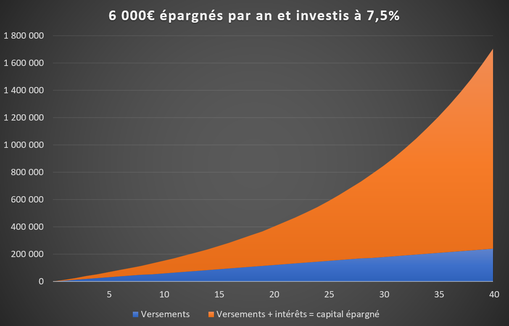
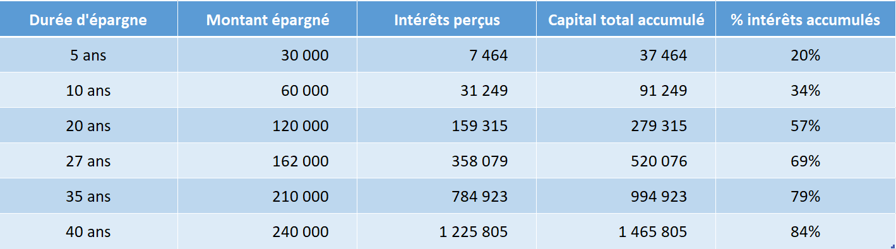
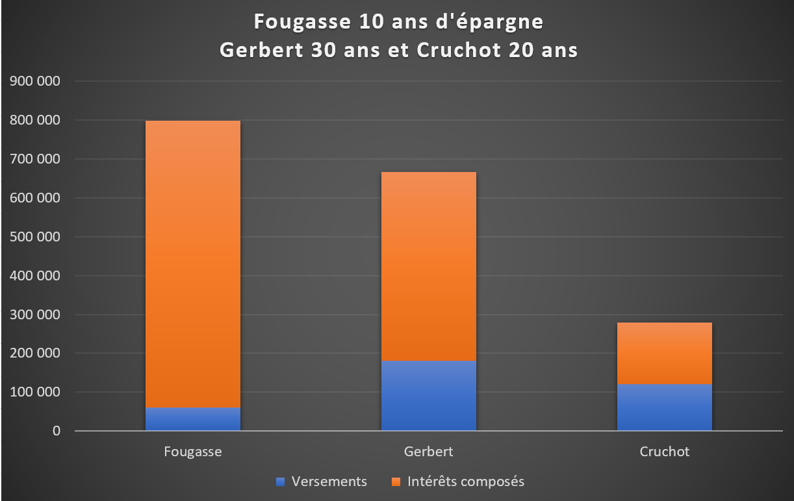

Les intérêts composés sont un concept extrêmement puissant qui est la base de quasiment toutes les stratégies d'épargne financière que vous allez rencontrer.

Albert Einstein lui-même, aurait qualifié avec humour, les intérêts composés de force la plus puissante de l'univers : "Les intérêts composés sont la huitième merveille du monde. Celui qui les comprend les accumule, celui qui ne les comprend pas les paie".

Le terme intérêts composési signifie simplement que vous allez gagner des intérêts sur les intérêts précédemment accumulés.

Considérons un capital fixe de départ de 10'000 rémunéré à 10% chaque année :

- Année 1 : 10'000 x 10% = 1'000€ d'intérêts
- Année 2 : (10'000 + 1000) x 10% = 1'100 d'intérêts
- Année 3 = (10'000 + 1'000 + 1'000) x 10% = 1'200 d'intérêts
- Etc.

Vous pouvez constater que les intérêts reçus ne restent pas fixes à 1’000€ mais augmentent un peu plus chaque année, car le capital sur lequel ils s'appliquent a lui-même été augmenté des intérêts précédemment accumulés.

Bien que cela puisse paraître anodin, c'est pourtant un concept essentiel, car la puissance des intérêts composés est phénoménale. Et ce qui pouvait à première vue paraître comme un objectif d'épargne inatteignable, comme devenir financièrement autonome, va pouvoir se réaliser sans trop d'effort, pour qui veut bien se donner un peu de temps.

<!-- C'est un peu comme rouler une boule de neige, la boule va progressivement gagner de la masse, au début la progression est lente, puis s'accélère de plus en plus, jusqu'à ce qu’on ne puisse plus la faire rouler tellement elle est devenue lourde. -->

’utilise le mot intérêt au sens large, pour définir tous les tous flux financiers qui participent à faire grossir votre épargne : les intérêts d‘un livret bancaire, le coupon d’une obligation, la plus-value lors de la revente d’une action ou le versement d’un dividende.

Pour bien saisir l'importance de la composition des intérêts, considérons deux exemples pratiques.
  

**Exemple 1 - Combien épargner pour accumuler 500'000 puis 1 million d'euros?**

Considérons que vous épargniez 500€ par mois, soient 6’000€ par an.

L'épargne est investie sur les marchés financiers avec un rendement annualisé moyen de 7,5% par an, nous ne considérons pas la fiscalité et l'inflation, nous raisonnons donc en euros constants pour simplifier.

Au bout de cinq ans, les intérêts accumulés s'élèvent à 7'464€.

Au bout de dix ans, c'est-à-dire qu'une même période de 5 ans supplémentaire s'est écoulée, les intérêts s’élèvent désormais à 31’249€, soient un supplément de 23’785€. Comparativement à la période initiale de 5 ans c’est 3 fois plus d’intérêts accumulés pour la même durée de détention.

Vous voyez clairement que la formation du capital s’accélère avec le temps. Vous avez là le phénomène de ce que l’on appelle les « intérêts composés », qui finissent d'ailleurs après un certain temps par être la contribution prépondérante à la formation de votre épargne.

Le niveau des 500’000€ sera franchi au cours de la 27ième d’année d’épargne. Pour quelqu’un qui aurait commencé à épargner vers 25 ans, cela veut dire ½ millions d’euros épargnés à 50 ans, soit un équivalent de 20k-30k€ en revenus financiers annuels.

Il a fallu 27 ans pour atteindre les 500'000€ et le capital est déjà doublé à 1 million d'euros en 8 ans supplémentaires seulement.

Il suffit d'initier le mouvement, puis laisser s'accumuler les intérêts suffisamment longtemps. La contribution des intérêts à l'accumulation de votre épargne est tellement importante qu'une une fois le cycle vertueux initié pour pourriez même considérer supprimer votre contribution annuelle et laisser votre épargne fructifier d'elle-même.

Simulons ce cas de figure dans notre second exemple.
  

**Exemple 2 - Je n'épargne pas longtemps, mais je démarre tôt**

Considérons maintenant 3 personnes qui investissent chacune 6'000€ par an sur des durées différentes:
- Fougasse investit 500€ par mois de 25 ans à 35 ans, soient 10 ans d'épargne.  
- Gerbert investit 500€ par mois de 35 ans à 65 ans, soient 30 ans d'épargne.
- Cruchot investit 500€ par mois de 45 ans à 65 ans, soient 20 ans d'épargne.

Pareillement au cas précédent, l'épargne est investie sur les marchés financiers avec un rendement annualisé moyen de 7,5% par an.

A 65 ans, nos trois acolytes décident de prendre leur retraite, voici l'épargne qu'ils auront accumulée:

La différence est impressionnante, bien que Fougasse n'ai épargné que pendant 10 ans, soient 60'000€, de l’âge de 25 ans à 35 ans, il aura accumulé le capital le plus important car les intérêts composés auront fonctionné plus longtemps, en l’occurrence pendant 40 ans (25-65 ans).

En comparaison, Gerbert qui aura fourni un effort d'épargne trois fois plus important de 180'000€ puisque qu'il aura épargné pendant 30 ans, de 35 ans à 65 ans, ne pourra jamais rattraper Fougasse parti le premier.

En ce qui concerne Cruchot, une épargne de 120'000€ constitué tardivement, de 45 ans à 65 ans, soient quand même 20 ans d'épargne, ne lui permettrons d'accumuler que le tiers de l'épargne accumulée par Fougasse, qui aura pourtant épargné moitié moins longtemps que lui.

Retenez qu’après un certain nombre d'année, l'essentiel de l'épargne accumulée ne proviendra pas tant des sommes épargnées mais bien plus de la composition des intérêts. Plus vous commencez tôt, plus vous bénéficierez de l'effet de ces intérêts composés.

<!-- **A retenir : Après un certain nombre d'année, l'essentiel de l'épargne accumulée ne proviendra pas de des sommes épargnées mais des intérêts composés. Plus vous commencez tôt, plus vous bénéficierez de l'effet de ces intérêts composés. Pensez à la boule de neige.** -->
