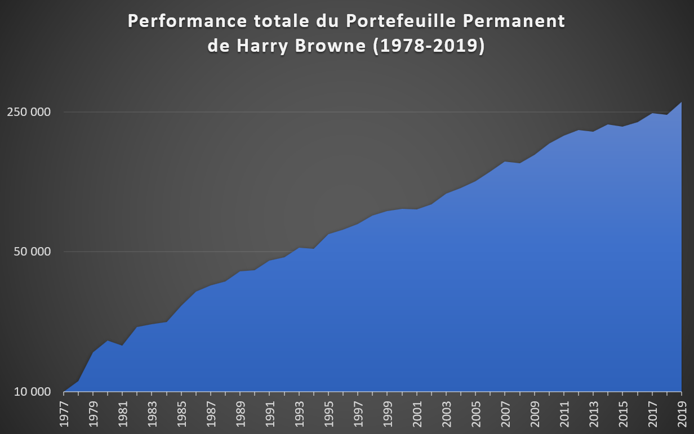
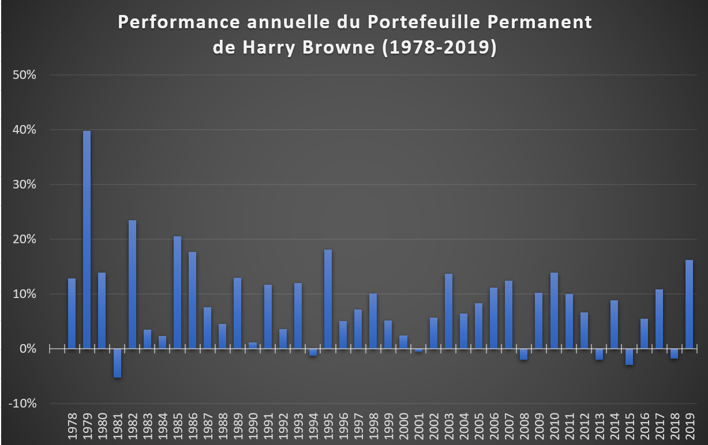

L'étape suivante va être, comment s'y prendre?

Pour la suite de mon exposé, je vais utiliser une stratégie d'épargne connue de certains investisseurs américains, le Portefeuille Permanent de Harry Browne. J'utiliserai cette stratégie comme support didactique pour vous expliquer les concepts importants à connaître dans la gestion d'un portefeuille financier.

[Harry Browne](https://en.wikipedia.org/wiki/Harry_Browne) (1933-2006), était un écrivain de nationalité américaine, investisseur et fervent défenseur des libertés individuelles. Il publia en 1999 son ouvrage ["Fail-Safe Investing"](https://www.amazon.com/gp/product/031226321X/) , dans lequel il présente la stratégie du « Permanent Portfolio".

Voici la stratégie:

Harry Browne préconise un investissement dans les 4 classes d'actifs les plus pures qui existent en finance : les actions, les obligations, l'or et le cash. L'investissement doit être réalisé à part égales sur ces 4 actifs et les poches doivent être rééquilibrées chaque année.

C'est tout!

Nous utiliserons les indices américains qui offrent l’historique de données le plus important. Mais le raisonnement pourra être extrapolé à tout autre pays.

La stratégie repose sur l’exploitation des cycles économiques qui sont au nombre de 4:
- Prospérité
- Récession
- Inflation
- Déflation

Chacun de ces cycles économiques va apparaître, dans n’importe quel ordre et pour des durées variables.

**L'économie est soit en expansion, nous connaissons la prospérité, soit en contraction, nous sommes alors en période de récession.**

Relativement à cette expansion-contraction de l'économie, la quantité de monnaie en circulation va elle aussi évoluer.

**Si la quantité de monnaie croit plus rapidement que l'expansion de l'économie, nous aurons de l'inflation (trop de monnaie dans le système). A l'inverse si la quantité de monnaie croit plus lentement que l'expansion de l'économie, alors nous aurons de la déflation (manque de monnaie dans le système).**

**Le phénomène est le même dans une économie en récession, si la quantité de monnaie diminue moins rapidement que l'économie ne se contracte, nous aurons de l'inflation, et si la quantité de monnaie diminue plus rapidement que l'économie ne décroit, nous aurons alors la déflation.**

La quantité de monnaie en circulation doit être adaptée au niveau de croissance ou décroissance de l'économie. C'est normalement le rôle des banques centrales d'ajuster ces niveaux de monnaie.

Ce sont des lois quasi absolues dans un système capitaliste libéral. À tout moment, l'économie évoluera dans l'une de ces 4 phases (croissance ou récession avec inflation ou déflation). Le temps passé dans chacune de ces phases peut varier de quelques mois, dans le cas par exemple d'une récession de courte durée, à une dizaine d'années, cas de la dernière période de croissance démarré après la crise immobilière de 2008.

Le déroulement et l'ordre des phases est difficile à prévoir. Il est toujours clair à fortiori de savoir dans quelle phase nous étions quand nous en sommes sortis, mais c'est souvent moins évident sur le moment présent. Sommes-nous en ce moment-même en période de croissance ou de contraction de l’économie?  La quantité de monnaie en circulation est-elle adaptée, en excès et source d’inflation, ou insuffisante et source de déflation?

A chacune de ces 4 phases du cycle économique correspond à un actif qui est le plus approprié pour bien performer:
- Prospérité: bon pour les actions
- Récession: bon pour les liquidités
- L'inflation: bon pour l'or
- Déflation: bon pour les obligations

En période de croissance il vaut mieux détenir des actions, en période de récession des liquidités, en période d’inflation de l’or et en période de déflation des obligations.

Ainsi, Harry Brown recommande de détenir chacun de ces 4 actifs en permanence, c'est-à-dire tout au long de l'année et à parts égales:
- La poche action est investie sur l’indice du marché action des USA
- La poche obligation est investie en obligations à long terme de l'État des USA
- L'or est détenu au travers d'un fond investi en or ou partiellement en or physique
- Le cash est investi sur des fonds monétaires sans risques

La beauté de cette allocation est qu'elle n'essaie pas de prédire l'évolution future de l'économie pour savoir sur quel actif investir. Il s'agit simplement de maintenir une allocation équilibrée entre ces 4 actifs. Ainsi nous aurons toujours au moins un actif approprié pour bien performer eu égard à l'état dans lequel l'économie se situe.

Ce type de portefeuille peut être réalisé très simplement et à moindre coût avec des trackers (ETF) ou fonds d'investissements.

Chaque fin d'année, il suffira de rééquilibrer les 4 poches, c'est-à-dire vendre les actifs qui auront le plus progressé pour acheter ceux qui auront baissé ou le moins progressé.

Comment une épargne ainsi investie s’est-elle comportée dans le passé?

Voici la performance historique de la stratégie du Portefeuille Permanent de Harry Browne depuis 1978 pour le marché US:

Une somme unique investie de 10'000€ s'est transformée fin 2019 en un capital brut de 281'182€.

Cela représente un rendement annualisé moyen de 8,27% avec plus de 80% des années qui ont eu un rendement positif et la plus mauvaise année n'était qu'une faible perte de -5,20%.

En déduisant l'inflation le rendement annuel moyen est de 4,67%, soient 40 ans à progresser à quasiment +5% par an au-dessus de l'inflation, diantre !
 

Comment une stratégie aussi simple peut-elle performer aussi bien? Une stratégie aussi efficace devrait être connue de tous?

Commençons par comprendre pourquoi la stratégie fonctionne, pour cela nous allons aborder les notions de risque, rendement et volatilité. La stratégie du Portefeuille Permanent de Harry Browne est composée de 4 actifs distincts qui peuvent être considérées comme les briques élémentaires de la finance, le marché des actions, des obligations, l'or et le cash. Chacune de ces classes d'actif a des caractéristiques de rendement et de risque qui lui est propre.