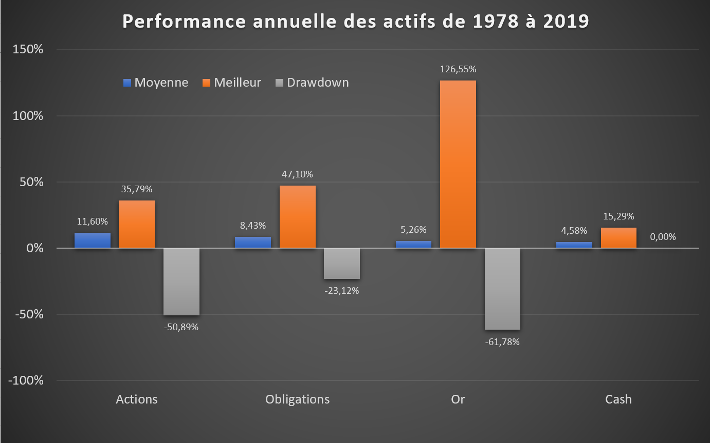

Nous savons, ou du moins nous nous doutons, qu'il ne peut y avoir de rendement sans risque, sauf à croire au Père Noël et confier son argent à un [Bernie Madoff](https://en.wikipedia.org/wiki/Bernie_Madoff) qui promettait des rendements réguliers. 

Voyons ce que sont les couples rendements-risques pour les actions, obligations, l’or et le cash sur le marché américain.

Ce graphique fait apparaître la performance moyenne de ces 4 actifs depuis 40 ans, avec leur meilleure année, leur "drawdown" et leur performance annuelle moyenne.

J'utilise le concept anglo-saxon de "drawdown" pour quantifier la baisse la plus élevée rencontrée dans le passé. Le drawdown mesure la perte maximale potentielle qu'il a fallu endurer entre 2 points hauts successifs du marché. Dans le cas de l'or, bien que la plus mauvaise année se termine à -33%, l'or a en fait enchaîné plusieurs années successives de pertes et en mettant bout à bout ces années successives de pertes, l'or a perdu jusqu'à -61,78% avant de repartir à la hausse et faire un nouveau sommet des années plus tard.

Nous pouvons voir des disparités importantes. L'or est l’actif qui a l'amplitude la plus élevée, sa meilleure année est à +126% et son drawdown s’établit à -62%.

A par le cash, aucun actif n’est à l’abri d’une ou plusieurs années en pertes. Sur le long terme, le cash investi sur des placements monétaires sécurisés du type assurance vie et livrets bancaires, a plus ou moins rapporté le niveau de d’inflation, quand cette inflation n’est pas trop forte.

La contrepartie d'un risque plus élevé est normalement un rendement annuel moyen plus élevé. C'est une caractéristique essentielle des économies capitalistes libérales, où à risque plus élevé doit correspondre une rémunération plus élevée, sinon à quoi bon prendre des risques et entreprendre?

Sur le marché américain, les actions apparaissent comme l'actif le plus rentable avec un rendement annuel moyen de +11,60% sur les 40 dernières années, suivi des obligations à long terme, l'or et le cash.

Cette amplitude de variation me permet maintenant d'introduire un concept important qui est celui de la volatilité.
