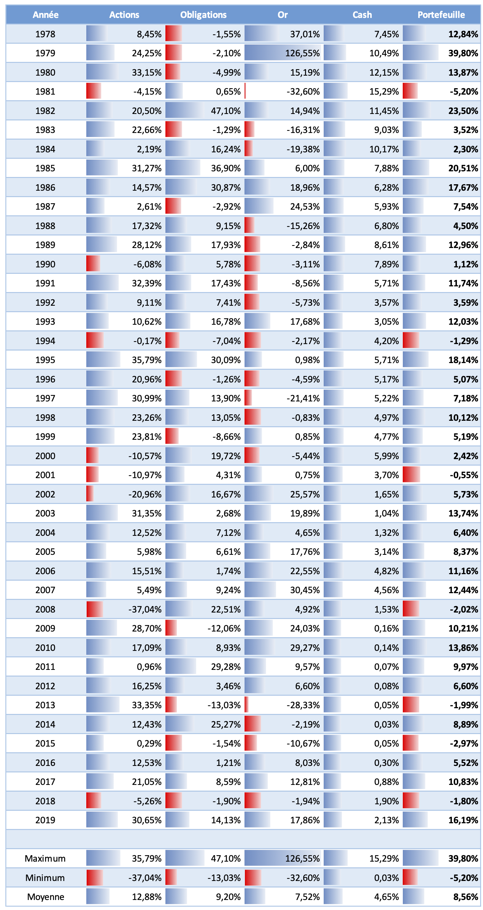

Nous pouvons maintenant aborder un concept essentiel dans la constitution d'un portefeuille financier, il s'agit de la diversification appelé également décorrélation.

Reprenons notre exemple du Portefeuille Permanent et voyons la performance de chacun des actifs qui le compose depuis 1978 :
  

  
Prêtez attention à la performance des actifs, les uns par rapport aux autres. Vous pouvez remarquer qu’ils ont tendance à bien performer chacun leur tour.

Lorsque l'économie est en récession et que les actions subissent des pertes importantes (crise internet de 2000, 2001, 2002 et crise immobilière de 2008), les obligations à long terme vont généralement bien performer et compenser en partie les pertes de la poche actions. Lorsque les obligations ont souffert, l'or a généralement pris le relais pour bien performer à son tour.

Les périodes où ces 3 actifs perdent de la valeur en même temps (1981, 1944, 2015, 2018) sont relativement rares. Pour la grande majorité des années vous avez toujours un ou plusieurs actifs qui vont performer et ainsi soutenir la performance globale du portefeuille.

Comparativement, le cash joue un rôle un différent, il est là pour amortir la volatilité globale du portefeuille du fait de sa très faible variation. Il ne va pas ou peu contribuer à la croissance du portefeuille, mais il va aider à le stabiliser.

Harry Browne a sélectionné ses 4 actifs sur la base de leur décorrélation, c'est-à-dire qu'ils vont évoluer indépendamment les uns des autres, puisqu'ils sont adaptés pour bien performé à tour de rôle dans chacun des cycles économiques qui vont se succéder. Durant les périodes de prospérités le moteur de la performance sera les actions, en période d’inflation l’or, en période de déflation les obligations et en période de récession le cash. C’est ce phénomène de diversification qui fait que la performance globale du portefeuille est incroyablement régulière, même si les actifs qui le composent peuvent être par moment particulièrement volatils considérés isolément.

Vous avez là la clef d'un portefeuille bien constitué, il ne s'agit pas de se focaliser sur la recherche d’actifs qui vont bien performer à chaque année sur le marché, mais plutôt de détenir des actifs qui vont bien performer à des moments différents les uns des autres afin de lisser la performance globale du portefeuille. Constituer un portefeuille diversifié est bien plus important que rechercher le meilleur placement sur lequel investir ses économies.

La diversification au travers de classes d’actifs diversifiés offre également un avantage supplémentaire. Considérez le scénario d'un crash boursier comme en octobre 1987 où le S&P500 a perdu 20.4% en une seule journée . Comme la poche action ne représentent que 25% du portefeuille, l’impact total au niveau du portefeuille global ne représente plus que le quart de cette perte, soient 5%, ce qui est quand beaucoup moins éprouvant!

**A retenir : Il est important de répartir ses investissements dans différentes classes d’actifs afin de pouvoir bénéficier de l’effet de la diversification qui va permettre de lisser la performance globale du portefeuille.**
