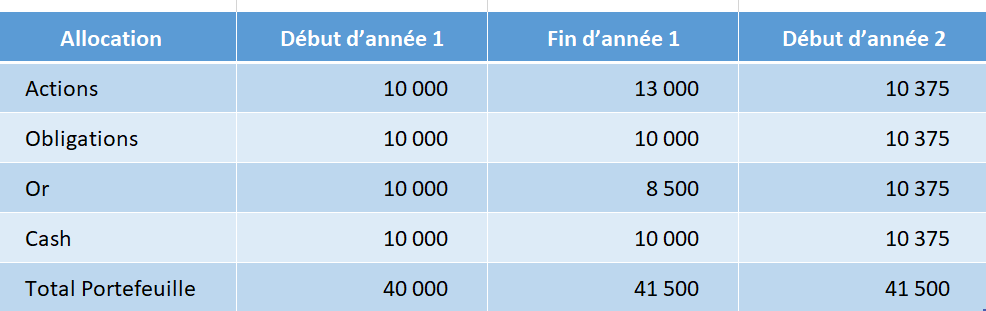

Au fils du temps, les montants investis sur chacune des 4 poches qui composent le Portefeuille Permanent vont évoluer. Certains actifs vont prendre de la valeur et d’autres en perdre.  Afin de préserver les bénéfices de la diversification, qui permet de lisser la performance globale du portefeuille, vous devez vous assurer que les 4 poches restent à peu près équilibrées.

Considérons par exemple une année où les actions ont progressé de 30%, l’or a baissé de 15%, les obligations et le cash sont restés inchangés. Vous devez à la fin de l’année rééquilibrer votre portefeuille pour que chaque poche redémarre à 25% de la valeur totale du portefeuille. C’est-à-dire dans notre cas, revendre une partie des gains réalisés sur les actions pour acheter principalement de l’or et un peu de cash et d’obligations.

Le rééquilibrage se fait uniquement quand les poches sont devenues significativement déséquilibrées. Si une des poches du Portefeuille Permanent (action, obligation, or, cash) qui doit normalement représenter 25% de l’allocation globale de mon portefeuille, finit par en représenter 35% (en gain) ou 15% (en perte), je dois alors rééquilibrer les poches entre-elles.

<!-- **A retenir : le rééquilibrage du portefeuille doit être fait de temps à autre, quand cela est nécessaire, afin de préserver l’avantage de la diversification des actifs entre eux, qui permet de lisser la performance globale du portefeuille.** -->