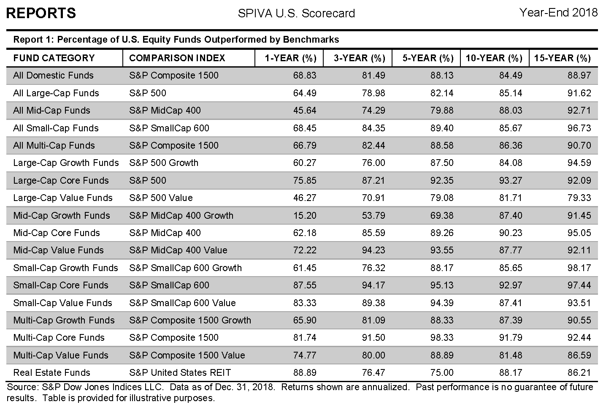

Comment choisir les meilleurs supports sur lesquels investir, faut-il privilégier les actions individuelles ou confier son épargne à des fonds d’investissements?

La réponse est assez simple, en tant qu’investisseur individuel, vous allez perdre votre temps si vous achetez des actions individuelles, le jeu n’en vaut pas la chandelle.  Il est bien plus aisé d’acheter des fonds ou trackers également appelés ETF, qui sont investis sur le marché des actions que d’acheter des actions individuelles et de devoir faire un suivi régulier de chacune d’entre-elles. Lesquels acheter, combien d’actions différentes acheter ? Si j’en achète trop peu, c’est-à-dire moins d’une dizaine et qu’une de ces actions fait faillite je risque de perdre 1/10 de la valeur de mon portefeuille actions. Un fonds bien diversifié sur le marché des actions n’a aucun de ses investissements qui concentre plus de 3 à 4% de la valeur total du fonds. Si vous voulez prendre la même précaution cela veut dire qu’il vous faudra investir dans au moins 25 lignes d’actions différentes. Et je ne parle ici que de l’allocation dans la classe d’actif des actions, le même problème va se répéter avec vos autres investissements dans les autres classes d’actifs tels que les obligations, le cash, etc.

Il existe principalement 2 catégories de fonds sur les marchés, les fonds à gestion active et les fonds à gestion passive.

- Un fonds est dit à gestion active quand le gérant décide lui-même sur quels actions, obligations investir, dans le but de faire mieux que l’indice du marché sur lequel il investit
  

- Un fonds est à gestion passive quand le gérant a pour unique objectif de recopier un indice. Si vous achetez un tracker CAC40, cela signifie que le gérant de ce fond doit recopier le plus exactement possible l’indice CAC40, il doit donc avoir en portefeuille la composition exacte des actions qui composent l’indice CAC40. On ne demande pas à ce gérant de prendre des initiatives dans la gestion du tracker, mais simplement d’être aussi rigoureux que possible pour recopier la performance de l’indice CAC40 au plus juste et à moindre coût.
  

Les frais de gestion prélevés par les gérants de fonds passifs sont bien plus faibles que les frais de gestion prélevés par les gérants de fonds actifs, car ils ont beaucoup moins de travail. Alors qu’un fond actif peut facilement prélever plus de 1% en frais de gestion, les fonds passifs se situent plutôt autour de 0.10% soient 10 fois moins.  Après 25-30 ans, une différence de 1% dans les frais de gestion peut facilement retirer 15-20% de votre performance totale à l’arrivée.

Quelle gestion pensez-vous sera la plus performante à long terme?

**De très loin la gestion passive! Quasiment aucun manager n’arrive à délivrer une performance sur le long terme qui permet de compenser le surcoût occasionné par leurs frais de gestion.**

Chaque année, l’étude [SPIVA](https://us.spindices.com/spiva/) compare la performance des fonds actifs et passifs qui sont investis sur les même marchés. A partir d’une durée de 5 ans, 80% des managers des fonds actifs font moins bien que leur indice de référence, au-dessus de 15 ans, c’est 90% des gestionnaires qui sont battus par l’indice. Conclusion, mieux vaut investir dans l’indice directement, c’est-à-dire choisir des trackers sur indice à gestion passive.

Dernière colonne de droite, pourcentage des gérants de fonds qui échouent à battre leur indice de référence, la statistique est sans appel!

Souvenez-vous quand j’ai introduit le Permanent Portfolio, j’ai formulé la question suivante: « Une stratégie aussi efficace devrait être connue de tous? »

La raison pour laquelle ce type de stratégie n’est pas plus répandue est très simple à comprendre, elle demande que vous soyez investi dans des fonds passifs, qui prélèvent le moins de frais possible et votre travail se limite à une opération de rééquilibrage chaque année. Il est impossible pour un gérant, dans de telles conditions, de prélever 1 à 2% de frais de gestion chaque année, quand il n’y a pas en plus des frais d’entrée et de sortie encore plus élevés! C’est toute une industrie qui dépend de votre croyance en leur savoir-faire, pour justifier des frais scandaleusement élevés.

Investir au travers de trackers passifs qui recopient des indices ne veut pas dire pour autant que vos choix d’investissements vont être limités. Bien au contraire, il existe des indices sur à peu près toutes les classes d’actifs, que ce soient les marchés des actions, l’immobilier, les obligations d’États, les obligations d’entreprises, les métaux précieux, les matières premières agricoles, pétrolières. Il existe plusieurs centaines de familles de trackers différentes sur lesquels investir.

**Alors que l’investisseur débutant à souvent tendance à se focaliser sur quelle action ou obligation acheter, en fait aussi surprenant que cela puisse paraître, cela importe assez peu. Si votre portefeuille d’actions ou d’obligations est suffisamment diversifié, la performance de ces allocations finira par s’aligner sur la performance globale du marché sur lequel vous êtes investi. Il est bien plus payant de d’ajouter des classes d’actifs supplémentaires et diversifiées, comme l’immobilier, les matières premières, plutôt que chercher à optimiser la liste des actions que l’on détient dans son allocation actions.**

Aujourd’hui les investisseurs privilégient largement les trackers sur indices à gestion passive avec les frais les plus faibles. Le tracker le plus important est le SPY du gestionnaire américain State Street Global Advisors qui recopie la performance du S&P500. Le montant des capitaux en gestion sur ce seul tracker étaient de plus de 300 milliards de USD début 2020 et les frais de gestion de 0.09% par an.
